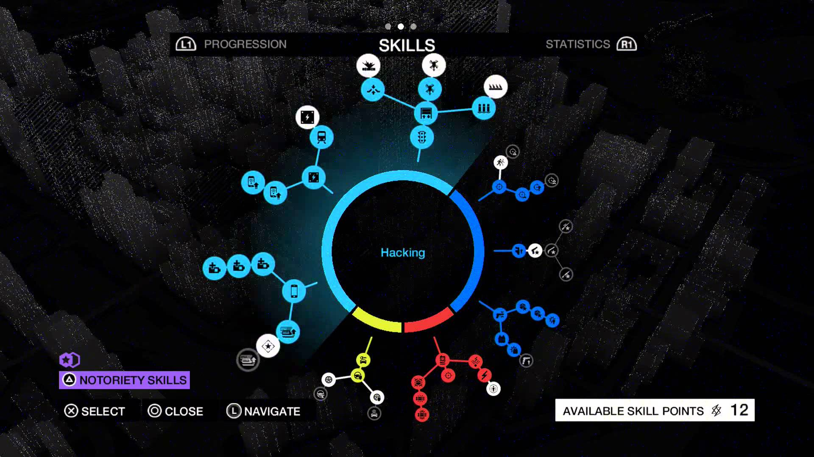

หลังจากที่ได้เขียน Programming 101 ในอันก่อนเรื่องที่บอกว่า ทำยังไงถึงเราจะเรียนรู้เทคโนโลยีใหม่ ๆ ได้อย่างรวดเร็ว (นี่ ๆ อ่านได้ที่[ลิงค์นี้][0])วันนี้เลยจะมาแชร์ทริก ไม่รู้เหมือนกันมันคืออะไร ผมคิดขึ้นมาใช้เอง ผมเรียกมันว่า **2-Days Miracle**

## เวลามีน้อยใช้สอยอย่างประหยัด

จริง ๆ ทริก (เรียกว่าทริกละกัน ไม่รู้จะเรียกอะไร) มันเกิดจากตอนเปิดเทอมก็ต้องเขียนงานหลายอย่าง ทำการบ้านอีก เรียนอีก ทำให้ไม่ค่อยมีเวลามานั่งเรียนเทคโนโลยีใหม่ ๆ เลย วันว่างมันจะมีอยู่แค่ เสาร์ และอาทิตย์ 2 วันเท่านั้น ด้วยความที่มันมีเวลาแค่ 2 วัน และความเซี้ยนส่วนตัวจากการที่อยู่ในโลกมืดเรียน ทำการบ้านและแข่งโน้นนี่นั่นอยู่หลายเดือนไม่ได้เรียนอะไรใหม่ ๆ สักเท่าไหร่เลยกะว่าจะมาเอาคืนให้สาสมใจ เลยบอกตัวเองว่า อย่างน้อยอาทิตย์นึง เราควรจะได้อะไรใหม่ ๆ มาละ อย่างที่บอกว่ามีแค่ 2 วัน ถามว่า อ้าวแล้วทำไงดีละ ? มันจึงทำให้เกิดสิ่งที่ผมเรียกว่า 2-Days Miracles

## เริ่มยังไงดี ???

หลาย ๆ ครั้งที่เราจะเริ่มเรียนรู้อะไรบางอย่างใหม่ ๆ ที่เราไม่เคยเรียนมาก่อน คำถามแรกที่เรามักจะถามบ่อย ๆ หรือสำหรับบางคนที่จับต้นชนปลายไม่ถูกจนเลิกล้มไปมักจะเริ่มด้วยคำถามว่า
>
> เริ่มยังไงดี ?

ก้าวแรกมักจะเป็นก้าวที่ก้าวยาก เท่าที่สังเกตตัวเองหลาย ๆ ครั้งจะพบว่า คำถามนี้มักจะเกิดกับเวลาเราเรียนอะไรที่มันใหม่แบบ โคตรใหม่ ไม่เคยมีพื้นฐานอะไรพวกนี้มาก่อน อารมณ์มันเหมือนเวลาเราเล่นเกม ที่เราจะสามารถอัพ Skill ของตัวละครที่เราเล่นได้ แต่จู่ ๆ เราจะอัพอันหลัง ๆ เลยก็ไม่ได้ใช่ม่ะ เราต้องค่อย ๆ อัพขึ้นไปเรื่อย ๆ ในโลกแห่งความเป็นจริงก็เช่นกัน เราก็ต้องค่อย ๆ อัพขึ้นไปเรื่อย ๆ เมื่อคำถามนี้เกิดขึ้นเราควรที่จะหา Keyword ที่เราไม่รู้ และค่อย ๆ ย้อนกลับไปแบบนี้เรื่อย ๆ ก็เหมือนกับที่เราค่อย ๆ อัพ Skill อันล่าง ๆ มาก่อนนี่ละ เท่าที่ผ่านมามันก็ช่วยได้ดีเลยละ มันทำให้เราเห็นเรื่องนึงที่เป็นสิ่งสำคัญมาก ๆ ไม่ว่ากับใน Area ไหน ๆ ไม่ใช่แค่ฝั่ง IT เท่านั้นคือ **พื้นฐานคือสิ่งสำคัญ** หลาย ๆ คนเห็นเทคโนโลยีใหม่ ๆ ก็ไปหยิบไปใช้กันอย่างมั่วซั่ว แต่เราอาจจะหลงลืมไปแล้วหรือยังว่า มันมาได้ยังไง มันมาจากไหน

## รากเง้าคือสิ่งสำคัญ

เมื่อกี้ได้บอกว่า พื้นฐานคือสิ่งสำคัญ ถ้าให้เทียบมันก็เหมือนกับรากเง้านี่แหละ เช่นเราบอกว่า เราอยากเรียนเกี่ยวกับ Computer ถามว่า ถ้าเราไม่รู้ว่ามันมาได้ยังไง มันมาจากไหน เราจะเข้าใจมันมั้ย ก็คงตอบได้ว่า มันก็พอได้แหละ แต่เราก็จะเข้าใจมันอยู่แค่ตรงนี้ไม่ได้ไปไหนต่อเหมือนกับเราเป็นแค่ User คนนึง การเรียนที่มาของมันเป็นพื้นฐานที่จะเชื่อมโยงให้เราเข้าใจสิ่งที่เรากำลังศึกษาได้ดีขึ้น และทำให้เราเห็นภาพชัดเจนมากขึ้นจนสามารถยกระดับจาก User กลายเป็น Developer ที่จะนำความรู้รากเง้าเหล่านี้มาสร้าง มาพัฒนาเพิ่มเติมให้เป็นสิ่งที่ดีขึ้น สิ่งสำคัญคือพยายามเชื่อมกับสิ่งที่เรารู้อยู่แล้วด้วย พยายามมองภาพรวมทั้งหมดของเรื่องให้ออก เหมือนกับที่เราเห็น Skill Tree ในเกมนั่นแหละ ฉะนั้นเวลาผมเรียนอะไรใหม่ ๆ ผมจะค่อย ๆ เรียนเทคโนโลยีที่เป็นฐานก่อนแล้วค่อยกระโดดไปเรียนสิ่งที่มันพัฒนาขึ้นมาเรื่อย ๆ ว่าแต่ละอย่างมันมีข้อดีข้อเสียยังไง ทำไมเขาถึงพัฒนาอันใหม่ขึ้นมาละ แต่ก็ไม่ต้องไปขนาดนั่งเขียน Assembly ก็ไม่ขนาดนั้นนะ (เอาจริงก็เขียนได้อยู่นะ) ก็ให้เราเรียนเท่าที่เราจำเป็นละกัน ไม่ต้องขนาดลงไปอะไรกับมันมากขนาดนั้น เอาให้เราสามารถต่อยอดได้ก็พอ

## นิสัย !!

หัวข้อนี้ไม่ได้ด่านะ ฮ่า ๆ แต่ ไม่รู้สิ เวลาเรียนอะไรไปเยอะ ๆ แล้วเหมือนแต่ละเรื่องมันก็มี นิสัย เป็นของตัวเอง เหมือนกับที่เราเรียนภาษา Programming การเรียน Syntax ของมันใคร ๆ ก็ทำได้ แต่ Best Practice ของมันสิ ว่าจะเลือกใช้อะไรตรงไหน เมื่อไหร่ ตรงนี้จะเขียนยังไงดีนะ อันนี้สิยาก ผมเปรียบเทียบตัว Syntax มันก็เหมือน Anatomy ของร่างกาย ส่วน Best Practice ก็เหมือนกับ จิตใจ นิสัย ของภาษานั้น ๆ ฉะนั้นการที่เราจะเข้าใจมันได้อย่างถ่องแท้ ที่พร้อมสำหรับการเอาไปลง Production คือการที่เราต้องเข้าใจ Anatomy ของ นิสัยของมันอย่างจริงจังซะก่อน ยกตัวอย่างเป็นภาษา Programming อีก เวลาที่เราเรียน เรามักจะเริ่มเรียนที่ Syntax ของมันก่อนละสินะ !! และหลาย ๆ คนมักจะจำมันไปเรื่อย ๆ และสุดท้ายมันก็จะไปจบที่ ไม่เข้าใจ ก๊อป ๆ ไปละกัน

## ลงมือทำ

ไม่มีวิธีไหนที่จะทำให้เราเข้าใจเท่ากับการลงมือทำอีกแล้ว แรก ๆ เราอาจจะเริ่มจากการก๊อปจากตัวอย่างนี่แหละ แต่ไม่ใช่ว่าก๊อปแล้วรันแล้วจบ ทำแบบนั้นนี่ไม่ได้ช่วยอะไรเลย อย่าหลอกตัวเองไปเลยว่า การที่รันได้แล้วจะจบ อย่าลืมที่จะค่อย ๆ ทำความเข้าใจด้วยว่า ทำไมเขาต้องเขียนแบบนั้นเป็นตัวอย่าง ค่อย ๆ วิ่งเข้าไปในแต่ละ Feature แต่ละ Function ว่ามันทำงานยังไง ให้อะไรมัน แล้วได้อะไรกลับมา และค่อยไปอ่าน Best Practice เมื่อเราเริ่มเข้าใจนิสัยของมันมากขึ้นแล้ว

## สรุป

อ่านมาถึงตรงนี้แล้ว อาจจะงง ว่าเขียนอะไรอยู่ฟร๊ะ !! ขอสรุปเป็นแบบนี้ละกัน การเรียนอะไรสักอย่างจุดที่น่าจะยากและน่ากลัวที่สุดน่าจะเป็น การเริ่มต้น ก็อยากให้นึกถึงเวลาเราเล่นเกม เราต้องค่อย ๆ อัพไปทีละ Skill ขึ้นไปเรื่อย ๆ และอย่าลืมที่จะไม่ละเลยรากเง้าของมัน จากนั้นก็ค่อย ๆ ลงลึกลงไปถึง นิสัยของมัน ว่ามันมักจะมีหน้าตาเป็นยังไง อะไรดี อะไรไม่ดี สำหรับมัน และสุดท้าย ท้ายสุดเพื่อให้เราเข้าใจมากขึ้น เราก็ต้องเอาสิ่งที่เราค่อย ๆ อ่านมารวบรวมมาใช้ในการลงมือทำ ทดลองสร้างอะไรที่มันง่าย ๆ แล้วก็ค่อย ๆ ไต่ขึ้นไปเรื่อย ๆ

ทริกนี้เป็นอะไรที่ผมใช้อยู่ทุกวัน อย่างที่เห็นผลเลยคือเรื่องของการสร้าง Wordpress Theme ถ้าจำเวอร์ชั่นแรกของ PaperTheme ได้นั่นแหละ ผมใช้เวลาในการนั่งเรียนวิธีการทำ เข้าใจโครงสร้างของมัน และสร้างออกมาเป็น PaperTheme ที่เราเห็นในเวอร์ชั่นแรก โดยใช้เวลาแค่ 2 วันเท่านั้นเอง กับอีกอันนึีงคือ Laravel สารภาพเลยว่าเป็นคนที่ไม่ค่อยถนัด Framework แต่ด้วยความเข้าใจกับ PHP อยู่แล้วเลยทำให้ใช้เวลาไม่นานก็เข้าใจ Laravel ได้อย่างง่ายดายเลยละ

[0]: https://www.arnondora.in.th/programming-101-learning-technology/
