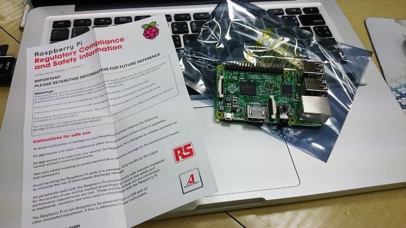
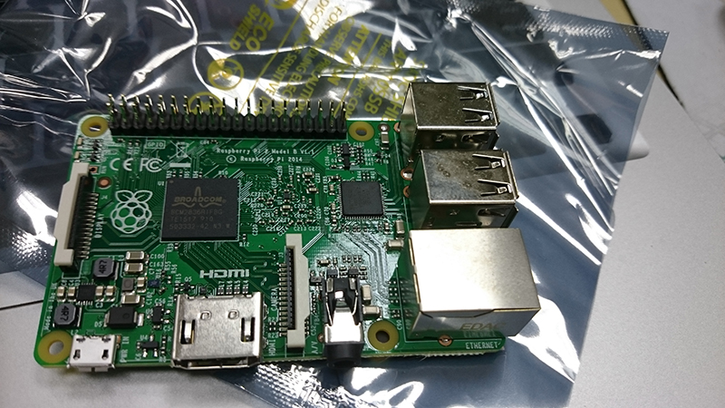
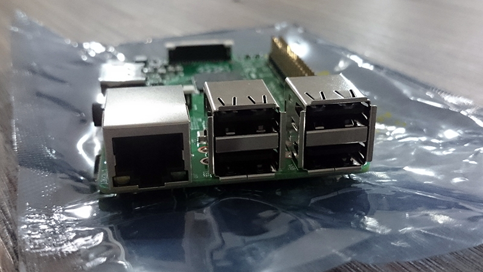
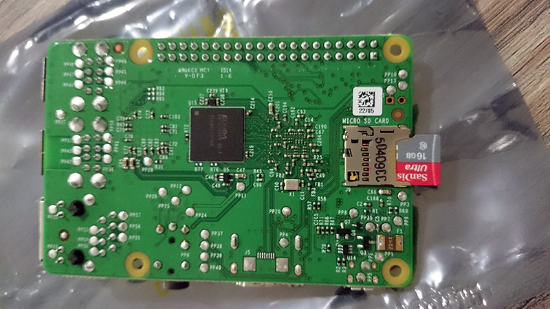
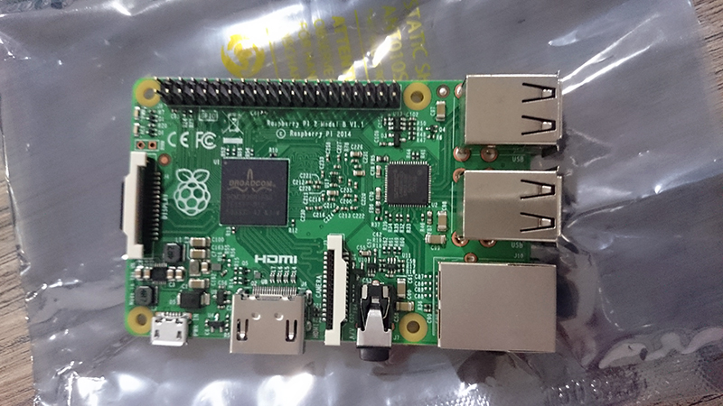
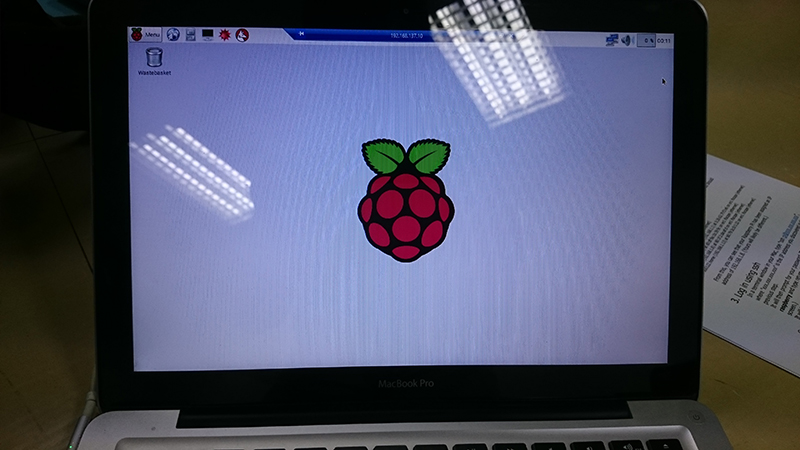

ช่วงนี้ก็ปิดเทอมอยู่ แต่ก็แอบมีงานที่มหาลัยบ้าง เลยไม่ค่อยจะได้เขียนอะไรมากเท่าไหร่ แต่วันนี้พิเศษ เพราะเราได้ของเล่นมาใหม่ นั่นคือ Raspberry Pi

## Raspberry Pi คืออะไร ?
มันคือคอมพิวเตอร์ขนาดเล็กอันเท่ากับขนาดของบัตรเครดิตเราเท่านั้นเอง (ทาง Raspberry Pi เขียนว่า credit-card sized computer) แต่ใช่ว่าเล็กแล้วจะทำอะไรไม่ได้ เพราะตัวมันทำงานด้วยระบบปฏิบัติการได้หลายแบบมาก  ส่วนใหญ่ที่ใช้กันก็จะเป็นทางฝั่ง Linux ซะมากกว่า เพราะมันฟรี และที่เจ๋งคือ Raspberry Pi 2 ตัวใหม่นี้สามารถลง Windows 10 IoT ได้ด้วยนะเออ
เนื่องจากที่ตัวมันทำงานด้วย Linux และมี Port การเชื่อมต่อที่เป็นมาตรฐาน เช่น USB ทำให้มันสามารถที่จะเสียบ Mouse และ Keyboard และต่อจอออกทาง HDMI ทำให้เราสามารถทำอะไรด้วยเจ้านี่ได้หลายอย่างเลย อาจจะเอาไปเล่นเน็ตง่าย ๆ , ทำงานเอกสาร , เครื่องตรวจวัดต่าง ๆ , หุ่นยนต์ หรือแม้กระทั่ง Web Server ยังได้เลย มีบางทีอยากได้ Server ก็เลยเอา Raspberry Pi หลาย ๆ ตัวมาเชื่อมต่อทำงานด้วยกัน ซึ่งมันดูเจ๋งมาก หรือจะเป็นเครื่องคอมพิวเตอร์ราคาถูกสำหรับเด็ก ๆ เพื่อให้เด็ก ๆ ฝึกเขียนโปรแกรมก็ได้เหมือนกัน ผมชอบอันนี้ที่สุดแล้วล่ะ
ที่สำคัญที่สุดเลย ราคาถูก และประหยัดไฟมาก มากกว่าโทรศัพท์พวกเราซะอีกมั้ง เราสามารถเสียบไฟเข้าผ่านทาง Micro USB ก็เพียงพอต่อการทำงานของมันแล้ว ด้วยความที่มันเล็ก และแหล่งพลังงานที่มีขนาดไม่มากทำให้มันเหมาะกับการทำงานได้หลาย ๆ อย่างมาก ๆ ดังตัวอย่างด้านบนเมื่อกี้

## จะรอช้าอะไรอยู่เล่า มาแกะกล่องกัน

ที่ผมสั่งซื้อมาก็จะมีตัว Raspberry Pi 2 Model B และตัวรับสัญญาณ Wifi มาอีกตัวนึง

ในกล่องของ Raspberry Pi 2 ก็จะมีตัวบอร์ดของเราและ กระดาษ 1 แผ่นที่เป็นคู่มือง่าย ๆ แต่แน่นอนผมเป็นคนไทย เพราะฉะนั้น เราจะข้าม ๆ มันไป มาดูที่บอร์ดของเรากันเลยดีกว่า

อย่างที่บอกได้ตอนแรกเลย ว่าขนาดของมันนั้น เท่าบัตรเครดิตเท่านั้นเอง ถ้าวางในมือก็ประมาณฝ่ามือของผมเท่านั้นเอง เล็กจริง ๆ ภายในบอร์ดก็จะมีวงจร อยู่เยอะแยะมากมาย แต่ตอนนี้เราจะมีสนใจที่ Port ของมันกันดีกว่า ที่เห็นตอนนี้ก็จะมี HDMI ไว้ต่อจอ และทางซ้ายล่างสุด อันเล็ก ๆ นั่นเป็น Micro USB ไว้จ่ายไฟให้ตัวบอร์ดของเรา (สามารถเอาสาย Micro USB และ Adapter ที่เราใช้กับโทรศัพท์เรามาเสียบได้เลย หรือสามารถใช้ Power Bank ไม่ก็เสียบตรงกับ USB ที่คอมเราแทนยังได้ และข้างขวาของ HDMI ก็จะเป็น Jack 3.5 mm เสียบหูฟังปกติเลย

มาที่ด้านข้างกันบ้าง เรียงจากด้านซ้ายของรูป ก่อนอื่นก็จะเป็น Ethernet RJ-45 หรือที่บ้านเราเรียกกันง่าย ๆ น่ารักใส ๆ ว่า Port Lan ถัดไปอีก 2 แถวที่เหลือก็จะเป็น USB Port 2.0 ปกติ ที่ใน Raspberry Pi 2 นั้น เพิ่มมาให้เราเป็น 4 Ports เลยทีเดียว จากแค่ 2 Ports ใน Version แรก

ถ้าเราลองสังเกตดูแล้ว จะสงสัยว่า เป็นคอมแล้ว HDD ล่ะไปไหน ? คำตอบมันอยู่ตรงนี้เลย ด้านหลังของบอร์ดจะมีช่องใส่หน่วยความจำ Micro SD Card อยู่ ซึ่งใน Version แรกเราจะใช้หน่วยความจำที่เป็น SD Card อันใหญ่ ๆ ที่ใช้กับกล้อง แต่ใน Version 2 จะต้องใช้เป็น Micro SD Card เท่านั้น เพราะฉะนั้นสังเกตดี ๆ นะอย่าซื้อมาผิด
คำแนะนำ เวลาเราเลือก SD Card มาใส่ Raspberry Pi ให้เราพยายามเลือก Card ที่มีความเร็วสูงหน่อย เพราะว่ามันต้องเป็นที่เก็บ OS ของเรา ถ้าเร็วไม่พอมันจะทำให้ระบบของเรามันจะดูช้า ๆ แปลก ๆ ถ้าเลือกไม่ถูกก็ซื้อไปเลย Class 10 ถ้ามีตังอีก เติมเป็น Class 10 U1 หรือสูงกว่าเลยก็ได้ จะดีมาก

ที่ตกใจสุดเลยคือ ตอนจับครั้งแรก มันไม่น่าราคาแค่พันกว่าบาทเลย เพราะคุณภาพของงานดีมาก ๆ ชิ้นส่วนประกอบแน่น ไม่ก๊องแก๊ง และเก็บลายละเอียดได้เนียบมาก ๆ เกินราคาพันกว่าบาทแน่นอน ผมชอบมาก ๆ เลยล่ะ

## การเชื่อมต่อ

การเชื่อมต่อในบอร์ดนี้ค่อนข้างทำได้เยอะอยู่พอสมควร ด้วย USB Port ที่มีมาให้ถึง 4 Ports ด้วยกัน แต่ก็ยังไม่เคยลองเสียบแบบพวก Ex.HDD ที่มันค่อนข้างจะกินไฟเยอะอยู่ ถ้าเสียบมาก ๆ ผมก็ว่าตัวบอร์ดมันไม่น่าจะรับไหวเพราะว่ามันใช้แค่ Micro USB ในการจ่ายไฟเอง แต่ก็สามารถเสียบ Mouse และ Keyboard ได้ตามปกติ และต่อ RJ-45 เพื่อเชื่อมต่ออินเตอร์เน็ตได้เลย

หรือเราจะใช้ Wireless Adapter ที่เราใช้กับคอมมาต่อผ่าน USB เพื่อเชื่อมต่อ Wifi ได้เลย ง่ายสุด ๆ เลย อันที่สั่งมาอันนี้ตก 400 กว่าบาทมั่งถ้าจำไม่ผิด แต่มันเล็กมาก ๆ เลย เล็กจน งง เลยกว่ามันเล็กได้ขนาดนี้เลยเหรอ

นอกจากที่เราสามารถต่อออกจอนอกผ่าน HDMI ได้แล้ว เนื่องด้วยมันก็เป็น Linux เราก็สามารถติดตั้ง VNC Server และ SSH เพื่อ Remote มันโดยตรงจากคอมเราก็ยังได้เลย ง่ายสุด ๆ ไปเลยล่ะ (แต่กว่าจะทำได้ ติดปัญหานานอยู่ เพราะทำครั้งแรกมั่ง เลยช้า)
หลังจากที่ได้ลองติดตั้งและเล่นอะไรเล็ก ๆ น้อย ๆ ก็อยากบอกเลยว่า มันเป็นบอร์ดที่ดีมากเลย สำหรับคนที่อยากจะสร้างอะไรสักอย่าง หรือ เอามาหัดเขียนโปรแกรมก็น่าสนุกไม่น้อยเหมือนกัน และด้วยราคาที่ไม่แพงมาก ก็ยิ่งทำให้มันน่าซื้อขึ้นไปอีก ใครที่ยังไม่เคยเล่น แนะนำให้ไปหาข้อมูลและลองซื้อมาเล่นดู แล้วจะรู้ว่า มันทำอะไรได้มากกว่าที่เราคิดได้ซะอีก สำหรับ Review นี้ก็มีแค่นี้ล่ะครับ สวัสดีครับ
