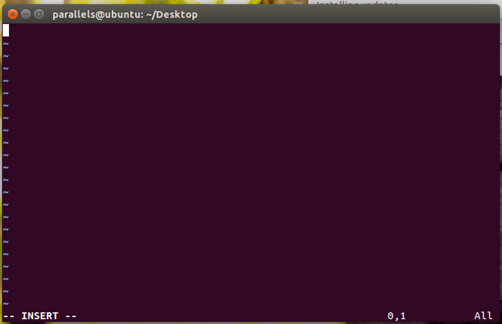
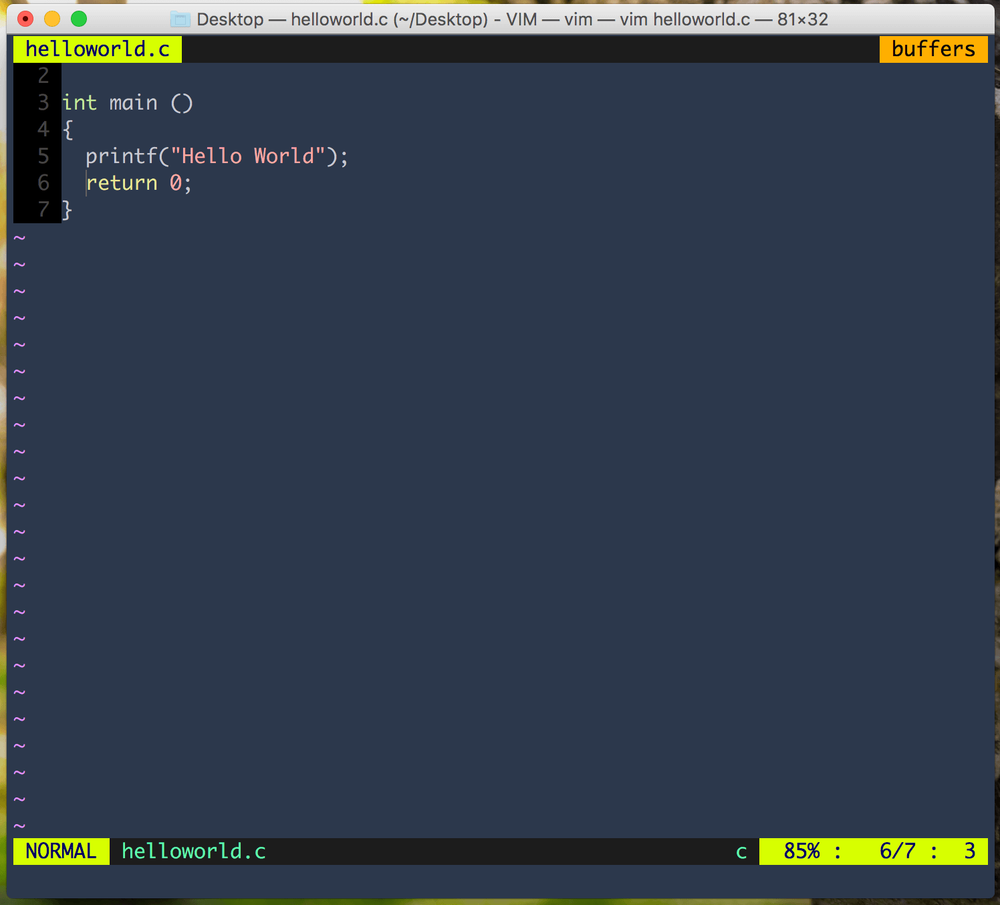

สวัสดีครับ ! ช่วงนี้หายไปนานเลย วันนี้ขอกลับมาด้วยหัวข้อที่คนที่พึ่งหัดเขียนโปรแกรมในสมัยนี้ไม่รู้จักหน่อยล่ะกัน นั่นคือ Text Editor ที่เป็นที่นิยมอย่าง Vi หรือ Vim นั่นเอง ในบทความนี้ผมจะอธิบายการใช้งานเบื้องต้นเท่านั้น ไม่มีเรื่องของการใช้ Plugin หรือการตั้งค่าต่าง ๆ นะครับ

#### Vi หรือ Vim คืออะไร ?
Vi หรือ Vim เป็น Text Editor ตัวนึง เหมือนกับ Atom หรือ Sublime Text ที่เราใช้ในปัจจุบัน แต่มันเกิดมาในยุคที่เก่ากว่า นั่นคือยุคที่เรายังใช้ Command Line เป็นหลัก กันอยู่ ข้อดีของมันในปัจจุบันคือ มันมี Module ให้เราเลือกโหลด และ เลือกเล่นเต็มไปหมด มันเยอะจนไม่รู้จะเล่นอะไรดี แต่ข้อเสียมันก็มีเหมือนกัน คือถ้าเราไม่เคยอ่าน Document หรือไปฟังใครมาก่อน เล่นเอง แรก ๆ มี งง แน่นอน

#### Vim ต่างจาก Vi ยังไง
ถ้าให้อธิบายง่าย ๆ Vim ก็คือลูกของ Vi นั่นเอง บางทีเราจะเรียก Vim ว่า **Vi Improved **ถ้าใครเคยเข้าไป มันจะเขียนอยู่ในวงเล็บเลยว่า Vi Improved เพราะมันก็คือ Vi ที่ถูกเพิ่มความสามารถเข้าไปนั่นเอง เช่นพวก Syntax Highlight และอื่น ๆ อีกมากมาย แต่ถามว่า Vim มีทุกอย่างที่ Vi มีหรือไม่ คำตอบคือ **ไม่** นะ บางอย่างมันก็ถูกเอามา บางอย่างก็ไม่ได้เอามาเหมือนกัน ส่วนมันมีอะไรบ้างนั้นก็จะไม่ขอพูดถึงละกัน เพราะไม่ค่อยมีข้อมูลตรงนี้เหมือนกัน ถ้าใครมีก็ช่วยมาตอบหน่อยนะครับ อยากรู้ทั้งหมดเหมือนกัน

#### การติดตั้ง
ถ้าใครที่ใช้ macOS อยู่แล้วก็ไม่ต้องทำอะไร เพราะมันถูก Pre-Installed มาในเครื่องเราอยู่แล้ว ส่วน Linux เช่น Ubuntu สามารถใช้คำสั่งตามด้านล่างเพื่อติดตั้งได้เลย

    sudo apt-get install vim

#### วิธีใช้งาน
มันก็คือ Text Editor ตัวนึงเลย การทำงานก็เหมือนกับ Text Editor ที่เราใช้งานตามปกติ แต่สิ่งที่เราต้องเรียนรู้เพิ่มเติมนั้นคือ **คำสั่ง **ต่าง ๆ เราต้องอย่าลืมนะว่า มันอยู่บน Command Line ฉะนั้น ไม่มีการเอาเมาส์มา ลากคลุม จะ Copy หรือ Paste อะไรได้เหมือนบน GUI ได้แน่ ๆ
ถึงตอนนี้อาจจะดูเหมือนยาก แต่ถ้าใช้ ๆ ไปจะพบว่า มันทำให้เราทำงานได้เร็วขึ้นมาจริง ๆ (ถ้าคล่องอะนะ) เพราะเราไม่ต้องยกมือขึ้นจาก Keyboard เลย มาลองดูคำสั่งเบื้องต้นกันดีว่า
เริ่มต้นด้วยการ **เปิดไฟล์ หรือการสร้างไฟล์ใหม่ **สามารถทำได้อย่างง่ายดายโดยการเรียกคำสั่งตามด้านล่างนี้ได้เลย

    vim ชื่อไฟล์

ถ้าไฟล์ที่มีอยู่แล้ว มันจะทำการเปิดไฟล์ขึ้นมา แต่ถ้าชื่อไฟล์ที่เราเรียกมันไม่มีอยู่ใน Directory ที่เราอยู่มันจะทำการเปิดไฟล์เปล่าขึ้นมาให้เราทันที เราสามารถพิมพ์ :q! เพื่อออกโดยไม่เซฟได้ หรือ :wq เพื่อออกแล้วเซฟได้เช่นกัน อันนี้เดี๋ยวหลังเรื่องของ Mode จะมาอธิบาย เรื่องของ Key ลัดต่าง ๆ

#### Mode ในการทำงาน
เมื่อเราเข้ามาในหน้าของตัวโปรแกรมแล้ว ถ้าเราลองพิมพ์มันจะพิมพ์อะไรไม่ได้เลย เพราะว่า มันอยู่ใน **Normal Mode **เลยพิมพ์ไม่ได้ ใน Vim เราจะแบ่ง Mode การทำงานออกเป็น 3 Mode ใหญ่ นั่นคือ

* **Normal Mode** หรือบางคนจะเรียกว่า Command Mode เป็น Mode ที่เอาไว้ใช้รับคำสั่ง หรือ Key ลัดบางตัว ถ้าให้มอง มันคือโหมด Standby เป็น คนกลาง เพื่อให้เราสามารถไปยัง Mode ต่าง ๆ ได้
* **Insert Mode** อันนี้แหละ ที่เราเอาไว้ใช้เมื่อเราจะ เพิ่มเติม แก้ไข หรือ ลบข้อมูลในไฟล์ของเราได้ เข้าโดยการกด **i**
* **Visual Mode** ถ้าเทียบกับ Text Editor ที่เป็น GUI คือ การเอาเมาส์ลากคลุมดำเลย เข้าได้โดยการกด **v**
วิธีการดูว่า เราอยู่ Mode ไหน เราสามารถ ดูได้จากด้านล่างของหน้าจอ มันจะมีเขียนอยู่ หรือถ้าใครใช้ Theme ต่าง ๆ ก็จะมีแสดงให้ดูเหมือนกัน ตามรูปด้านล่างเลย และเมื่อเราต้องการออกจากโหมดนั้น ๆ เราสามารถใช้ปุ่ม **esc** เพื่อไปยัง Normal Mode ได้

Vim บน macOS ของผมมันลง Plugin ไปแล้ว เอามาใช้ให้ดูเลยไม่ได้ เอาใน VM มาให้ดูแทน

#### กลับมาที่วิธีใช้งานต่อ
ตอนนี้ขออธิบายการใช้คำสั่งใน Normal Mode ก่อน ในการใช้คำสั่ง เราจะต้องอยู่ใน Normal Mode ก่อน (แหงแหละ) แล้วพิมพ์ Colon (:) หรืออัขระเฉพาะต่าง ๆ เช่น Slash (/) แล้วตามด้วยคำสั่ง เช่นถ้าเราต้องการจะออก โดยไม่เซฟ และไม่ต้องถามหรือยืนยันอะไร เราสามารถพิมพ์ :q! ได้เลย ง่ายมาก ๆ
ถ้าวิธีจำง่าย ๆ ของตัว w กับ q คือ ผมจำว่า w คือ Write หรือเซฟไฟล์ และ q คือ Quit คือ ออกนั่นเอง ฉะนั้น ถ้าเราต้องการจะออก แล้วเซฟด้วย เราก็ใช้ **:wq** คือ เขียนแล้วค่อยออกนั่นเอง ง่ายมาก ๆ เลย นอกจากนี้เรายังสามารถ ย้าย Cursor ของเราไปยังบรรทัดต่าง ๆ ได้โดยใช้

    :บรรทัดที่ต้องการไป เช่น :13

มันก็จะย้าย Cursor ไปยังบรรทัดนั้น ๆ ทันที หรือ ถ้าเราต้องการที่จะ ย้าย Cursor ไปหาคำนั้น เราสามารถใช้

    /คำที่ต้องการ เช่น /printf

มันก็จะย้าย Cursor (กระโดด) ไปที่ ที่มีคำนั้น ๆ ที่อยู่ใกล้ที่สุดได้ทันที ถึงตอนนี้ เราสามารถ ทำงานพื้นฐานได้แล้ว ทั้งการย้าย Cursor ไปยังที่ต่าง ๆ ได้โดยใช้คำสั่ง และการเข้าถึง Mode ต่าง ๆ ได้เช่นกัน นอกจากทั้ง 2 อย่างที่ได้เล่าไปแล้ว ยังมี Key ลัดต่าง ๆ  ที่จำเป็นดังนี้

* x = ลบตัวอักษรข้าง ๆ ตัวเดียว
* dw = ลบคำข้าง ๆ
* dd = ลบทั้งบรรทัด
* u = ย้อนการกระทำ หรือภาษาอังกฤษคือ Undo (ไม่รู้จะใช้ภาษาไทยว่าอะไร)
* yy = Copy ทั้งบรรทัด
* p = วางข้อความที่เรา Copy ไว้

ส่วนที่เหลือ คงต้องให้ไปเปิด Tutorial กันเอง เพราะมันเยอะเหลือเกิน ยิ่งถ้าลง Plugin เช่น EasyMotion นี่อย่าเรียกว่า กระโดด เลยให้เรียกว่า**บิน** เลยเถอะ แรก ๆ ก็ไม่ค่อยเข้าใจ ใช้แล้วช้า แต่ตอนนี้ บิน อยู่ในไฟล์แล้ว เร็วมาก ๆ และยังมี Plugin อื่น ๆ ให้เราเลือกใช้งานได้
นอกจากจะมี Plugin ให้ใช้มากกมายแล้ว ยังมีเรื่องของ Theme ให้เราเลือกโหลดมาใช้ได้ด้วย เช่นของผมเป็น Theme ชื่อ [Airline][1] สามารถไปโหลดมาติดตั้งลงไปได้เลย ส่วนเรื่องของการ Config อะไรต่าง ๆ ขอไม่พูดถึงในบทความนี้ เพราะมันจะยาวมาก ๆ แต่ขอให้พึงระวังไว้ว่า จะ Config อะไร **ให้เราสำรองไฟล์ Config ของเก่าไว้เสมอ** เผื่อในกรณีที่พิมพ์ผิด หรือทำอะไรผิด เราจะได้ย้อนกลับได้ ซึ่งวิธี Copy File อะไรบน Command Line ก็น่าจะทำเป็นกันอยู่แล้วเนอะ

#### สรุป
Vim เป็น Text Editor ตัวนึงที่ **ทรงพลัง** มาก แรก ๆ ที่เราใช้ มันอาจจะทำให้เราช้า เพราะยังไม่คุ้นชิน แต่ถ้าเราเริ่มชินกับมัน และ Config ให้เข้ากับตัวเราแล้วละก็ **บิน** เลยฮ่ะ ตอนแรก ๆ ที่ผมใช้ก็มีอาการมึน งง อยู่เหมือนกัน หลัง ๆ นี่คือ กดเอา กดเอา ไม่มีการ AFK มาจับเมาส์เลย ถึงดูหน้าตามันจะดูกัง ๆ สู้ Text Editor ตัวอื่นไม่ได้ แต่ถ้ารู้จัก Config นี่รับรอง Text Editor ตัวไหนก็เอาไม่อยู่ แนะนำให้หันมาลองใช้กันนะครับ
ถ้าใครต้องการเรียนรู้วิธีการใช้งานเพิ่มเติม[http://www.openvim.com][3] ก็สอนได้ดี เรียนบนเว็บได้เลย ไม่ต้อง Install หรือสามารถหาเพิ่มเติมได้จาก คนที่เรียนคอมพิวเตอร์**ที่มีอายุหน่อย**ก็น่าจะเคยใช้กันมาหมด

[3]: http://www.openvim.com
