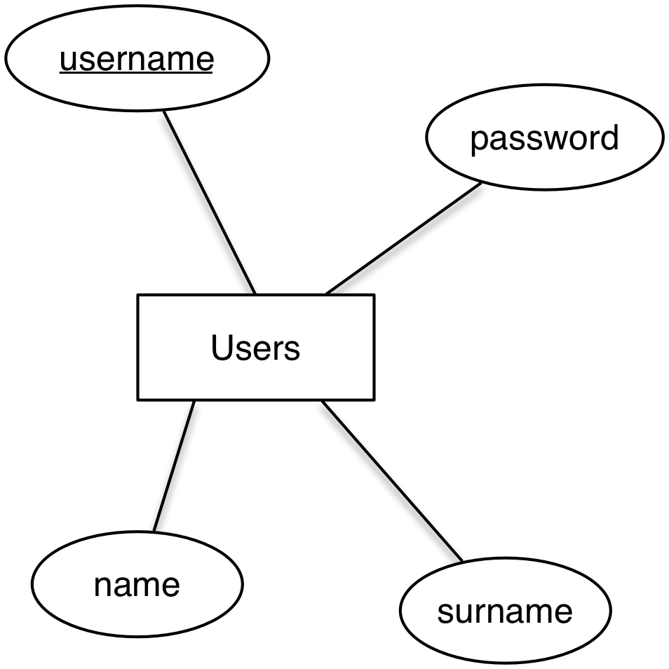

ถ้าใครที่ใช้ Laravel ใหม่ ๆ ก็อาจจะสงสัยว่า Migration ใน Laravel มันคืออะไร แล้วมันเกิดมาเพื่ออะไรกันแน่ วันนี้เราจะมาทำความเข้าใจกับ Database Migration ใน Laravel กัน

## Database Migration คืออะไร ?
ก่อนที่เราจะเข้าใจความหมาย เรามาดูกันก่อนว่า ปกติแล้ว เราทำงานกับ Database ในเว็บกันอย่างไร กับผม ก่อนที่จะมาใช้ Laravel ผมก็จะเขียน ERD แล้ว Implement ลงใน DBMS ที่ใช้เช่น MySQL หรือ SQL Server ก็ว่าไปแล้วแต่ Project และพอผมทำเสร็จผมก็จะ Backup ตัว DB แล้วส่งต่อให้ในทีมเอาไปทำต่อ
ถ้าเกิดวันหนึ่งผมต้องเปลี่ยนชื่อ Field สักตัวใน DB นั่นแปลว่า ผมต้องส่งตัว Backup ของ DB ให้ในทีมแบบนี้ไปเรื่อย ๆ และเราจะไม่มีทางรู้เลยว่า มันมีอะไรเปลี่ยนแปลงไปบ้าง นอกจากเราจะทำ ERD แล้วแบ่งออกเป็นเวอร์ชั่นไปเรื่อย ๆ ที่ยากอีก เราก็ต้องมาไล่ดูอีกว่าอะไรเปลี่ยนไปบ้าง ถ้า DB เรามีสัก 2--5 Table ก็แล้วไป แต่ถ้าเราทำงานกับระบบใหญ่ ๆ ละจะเกิดอะไรขึ้น รับรองว่า เปลี่ยนกันทีนี่มี **โกรธ** แน่นอน
ระบบ Migration ใน Laravel จึงเกิดขึ้น โดยมันอธิบายแต่ละ Table ด้วย Code PHP ได้เลย พอเราจะส่ง Project ไปให้คนในทีมทำงานต่อ เราก็ไม่จำเป็นต้องส่งตัว DB ตามไปด้วย (ถ้าไม่มีข้อมูลอะไรนะ) เพราะเราสร้างพิมพ์เขียวไว้ใน Code อยู่แล้ว ที่เหลือก็แค่รันคำสั่ง Migrate ก็เป็นอันเรียบร้อย
จะเห็นได้ว่า มันทำให้เราทำงานได้สะดวก และรวดเร็วขึ้นมาก นอกจากนั้น เราสามารถ ไล่ดูการเปลี่ยนแปลงได้ด้วย เพราะเวลาเราเก็บแต่ละครั้งของการ Migrate เราจะแยกเป็นเหมือนเวอร์ชั่นที่แสดงการเปลี่ยนแปลงของแต่ละเวอร์ชั่นเลย ทำให้เรามั่นใจได้ว่า เราสามารถ ย้อนกลับ ได้ในกรณีที่เราทำพลาดอะไรขึ้นมา

## มาทดลองกันเลยดีกว่า

เราจะทดลองสร้าง Table ชื่อ Users ขึ้นมาเพื่อเก็บ ชื่อ, นามสกุล, Username และ Password กัน ฉะนั้น Field ใน Table นี้ของเราก็จะมีแค่ 4 อย่าง
เหนือสิ่งอื่นใด เราต้องสร้าง ไฟล์สำหรับเก็บการเปลี่ยนแปลง (ไม่รู้จะเรียกอะไรดี ใครมีชื่อดี ๆ ก็บอกหน่อย) กันก่อน โดยให้เราเปิดหน้าต่าง Terminal ของเรา และ cd ไปที่ Path ที่มี Project ของเรา และพิมพ์คำสั่งด้านล่าง

    php artisan make:migration create_users_table —create=users

คำสั่งด้านบนเป็นการสร้างไฟล์สำหรับเก็บการเปลี่ยนแปลง โดยเราให้มันมีชื่อว่า **create\_users\_table** และบอกให้มันสร้าง Code สำหรับสร้าง Table ที่ชื่อว่า **Users** ให้ด้วย
หลังจากนั้นเราจะได้ไฟล์ตัวนึงขึ้นมา อยู่ใน Folder **database/migration** ให้เรากดเข้าไป เราจะเห็น Code อะไรเต็มไปหมด มันเกิดจากคำสั่งที่เรารันไปเมื่อกี้ มันสร้างของพวกนี้มาให้เรา สะดวกดี หลัก ๆ มันจะแบ่งออกเป็น 2 ส่วนนั่นคือ

* **Up Function** ใน Function นี้จะเป็นการบอกว่า ตอนที่เราทำการ Migrate ให้ Laravel ไปทำอะไรบ้าง
* **Down Function** เก็บสิ่งที่ Laravel ต้องทำเวลาเรา Refresh หรือ Reset DB ของเรา
ตอนนี้ขอให้เรา สนใจที่ **Up Function** ก่อน ตอนนี้ Laravel ได้ทำการสร้างอีก Function นึงขึ้นมาให้เรา ตามด้านล่างนี้

    Schema::create(‘users’, function (Blueprint $table) {
        $table->increments('id');
        $table->timestamp();
    }

โค๊ตตรงส่วนนี้มันบอกว่า ให้ทำการสร้าง Table ชื่อว่า **users** ขึ้นมา และใน Table users ให้มี field อยู่ 2 อันนั่นคือ id ที่เป็น Auto Increment และมี Timestamp
โดยเราสามารถเพิ่มและลบ Field ได้ตามสะดวก จากเมื่อกี้ เราต้องการเก็บ ชื่อ, นามสกุล, Username และ Password เราสามารถแก้ไข Function ได้เป็นดังนี้
Function นึงขึ้นมาให้เรา ตามด้านล่างนี้

    Schema::create(‘users’, function (Blueprint $table) {
        $table->string(‘name’);
        $table->string(‘surname’);
        $table->string(‘username’)->unique();
        $table->string(‘password);
    }

จากคำสั่งด้านบน ผมสร้าง Field ที่มี Datatype ที่เป็น String แล้วตามด้วยชื่อ Field และตรง **unique()** เป็นการบ่งบอกว่า Field นี้ห้ามซ้ำนั่นเอง
หลังจากที่เราเขียนตัว Migration Script เสร็จแล้ว ขั้นตอนต่อไปคือการไป ตั้งค่า Environment ของเรา ว่า Database ของเราอยู่ที่ไหน โดยเราต้องเข้าไปที่ไฟล์ .env ของ Laravel และทำการตั้งค่าให้เรียบร้อย (จะไม่ขออธิบายการตั้งค่าตรงนี้)
จากนั้นเราจะทำการ Migrate ตัว Migration Script ของเราเข้ากับ Database ของจรืงกันเลย โดยใช้คำสั่ง

    php artisan migrate

ถ้าเราลองเข้าไปเช็คที่ DB ดูจะเห็นว่า Table users ที่เราพึ่ง Migrate ไปอยู่ใน DB ของเราเรียบร้อยแล้ว ถ้าเกิดว่า เราเขียน Migration Script ผิด เราสามารถให้มัน Undo ได้โดยการใช้คำสั่ง

    php artisan migrate:rollback

หรือถ้าเราต้องการให้มัน **ลบ** ทุกอย่างออกแล้วทำการ Migrate ใหม่แต่ต้นเลย เราสามารถใช้คำสั่ง

    php artisan migrate:reset

#### สรุป
การใช้ระบบ Migration บน Laravel จะทำให้เราจัดการกับฐานข้อมูลของเราได้ง่ายขึ้นมาก ทำให้เราสามารถ แก้ไข และเปลี่ยนแปลง ฐานข้อมูลของเราได้สะดวก รวดเร็ว ง่ายดาย และปลอดภัย กว่าการที่เรามานั่งทำผ่าน GUI หรือ CLI ของ DBMS ตรง ๆ นอกจากนั้น ทำให้เราแชร์ Project ไประหว่างคนในทีมได้ง่ายมากขึ้น เพียงแค่รันคำสั่งเพื่อ Migrate เราก็จะได้ Database ออกมา ลดเวลา และความซับซ้อนในการทำงานได้เยอะมาก ๆ ลองเอาไปใช้ดูได้นะครับ
**Document ของ Laravel** :[https://laravel.com/docs/5.2/migrations][1]

[1]: https://laravel.com/docs/5.2/migrations
