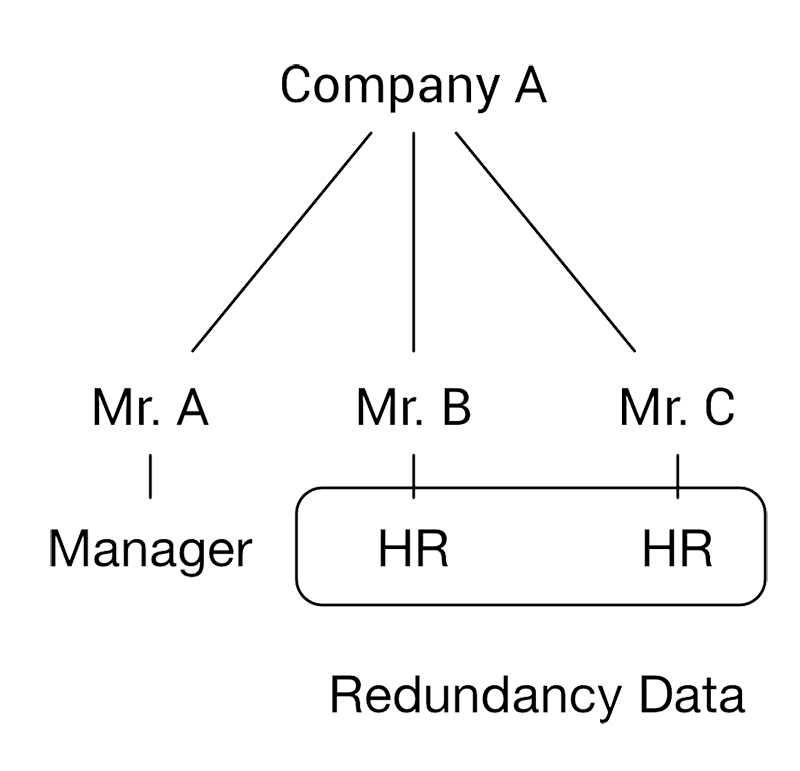
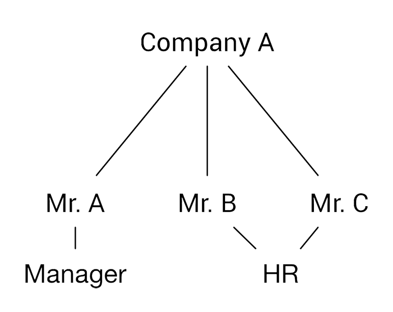

หลาย ๆ โปรแกรมที่เราใช้อยู่ตอนนี้ เช่น Facebook หรือแม้กระทั่งโทรศัพท์ ทุก ๆ อย่างตอนนี้ก็ต้องใช้ฐานข้อมูลทั้งหมดเลย เราเลยจำเป็นที่ต้องรู้ว่า มันทำงานยังไง แล้วเราจะออกแบบมันยังไง ใน Tutorial เราจะมาพูดในเรื่องของการออกแบบฐานข้อมูล (ไม่เน้นนะว่าจะเอาไปสร้างด้วยฐานข้อมูลอะไร เช่น MySQL หรือ SQL Server ใช้ได้หมด เราแค่จะมาเรียน เรื่องของหลักการออกแบบเท่านั้น)
แต่ก่อนที่เราจะไป เข้าใจถึงการออกแบบหรือ การทำงานของมัน เราจะต้องมาเรียนรู้กันก่อนว่า เมื่อก่อนจนถึงตอนนี้ฐานข้อมูลมันเป็นยังไง

]

ในสมัยแรก ๆ เราก็เก็บข้อมูลลงไฟล์ไปเรื่อย ๆ (เราจะเรียกมันว่า Data File System) จนถึงเวลานึงข้อมูลมันก็มีเยอะขึ้นเรื่อย ๆ เราเลยลองเก็บมันให้เป็นระเบียบมากขึ้นเพื่อให้เราเข้าถึงได้ง่ายขึ้น โดยที่เราจะเก็บข้อมูลเป็นลำดับชั้นไปเรื่อย ๆ เราจะเรียกมันว่า Hierarchical model โดยเราจะเชื่อมข้อมูลของเราเป็นเหมือนแผนภูมิต้นไม้ โดยที่ 1 child จะมีได้แค่ 1 parent แต่ 1 parent จะมีได้หลาย ๆ child
โดยเราจะเรียกความสัมพันธ์แบบนี้ว่า **one-to-many** อธิบายง่าย ๆ คือ จาก 1 ไปได้หลายอัน แต่ตรงกันข้ามกัน จากหลาย ๆ อันก็จะมีตัว parent ได้เพียงแค่ ตัวเดียว เท่านั้น
แต่แล้วปัญหาก็งอก เมื่อมันเกิดปัญหา Data Redundancy (การซ้ำซ้อนของข้อมูล) ขึ้นมา ทำให้นักคอมพิวเตอร์ในสมัยนั้นก็ต้องคิดหาทาง เพื่อที่จะลดความซ้ำซ้อนของข้อมูลให้ได้ จนเกิดมาเป็นฐานข้อมูลอีกแบบนึง

]

เราเรียกว่า **Network Model** โดย Model นี้จะ**ต่างจาก Hierarchical model ตรงที่ เราต้องการที่จะลด ความซ้ำซ้อนของข้อมูล เราเลยยอมให้เกิดความสัมพันธ์อีกแบบ** แบบ **many-to-many** (1 child จะมีได้มากกว่า 1 parent) ขึ้นมา แต่งานก็เกิดอีก เพราะว่า ถ้าเราออกแบบฐานข้อมูลแบบนี้ โปรแกรมเมอร์งานเข้าเลย เพราะว่า เราจะไม่สามารถออกแบบโปรแกรมที่เป็นอิสระต่อข้อมูลได้ หรือก็คือ ถ้าฐานข้อมูลเปลี่ยน เราก็ต้องเขียนโปรแกรมใหม่เพื่อให้ตามฐานข้อมูล
แต่ ๆ เพื่อแก้ปัญหานี้ **ฐานข้อมูลแบบ Relational models จึงเกิดขึ้นมา เพื่อแก้ปัญหาของทั้ง Hierarchical model ที่เกิด ความซ้ำซ้อนของข้อมูล และ Network Model ที่โปรแกรมมันไม่ได้เป็นอิสระต่อข้อมูล** ทำให้ฐานข้อมูลแบบนี้ถูกใช้มาเรื่อย ๆ จนถึงปัจจุบันนี้
ซึ่ง **Relational Models เป็น Model ในการออกแบบฐานข้อมูลที่ค่อนข้างเรียบง่าย และไม่ซับซ้อนมาก ซึ่งเราจะเก็บข้อมูลในรูปของตาราง และในตารางจะมี Row , Column เหมือนกับเราวาดตารางบนกระดาษเลย**
อย่างที่บอกว่า ในปัจจุบันนี้ ส่วนใหญ่เราก็ใช้ฐานข้อมูลที่มาจาก Relational Model กันอยู่ เพราะด้วยประสิทธิภาพ ความเรียบง่าย และตัวโปรแกรมไม่ยึดติดกับฐานข้อมูล ทำให้ในปัจุบันมีหลาย ๆ **บริษัทได้ผลิตโปรแกรมเพื่อช่วยให้เราสร้างฐานข้อมูลได้อย่างง่ายดาย เช่นพวก MySQL , SQL Server หรือ Oracle database** ออกมาให้เราเลือกใช้เยอะมาก ๆ ซึ่งแน่นอนว่า แต่ล่ะเจ้าก็มี Key Feature ออกมาฆ่าแกงกันอยู่แล้ว เพราะฉะนั้นเราก็ต้องเลือกให้เหมาะกับงานของเราด้วยเช่นกัน
แต่ เรื่องมันก็ยังไม่จบแค่นั้นน่ะสิ เนื่องด้วย คนเราสามารถเข้าถึง Internet มากขึ้น ทำให้ข้อมูลก็มากขึ้นตามไปจำนวนคนที่ใช้ อารมณ์เหมือนมาทิ้งขยะเอาไว้ พอเรื่อย ๆ มันก็เยอะจนเป็นกอง ๆ เต็มไปหมด จนทำให้เกิดฐานข้อมูลอีกแบบนั่นคือ Non Relational Database (เรื่องเยอะนะ) ข้อดีของมันคือมันทำงานกับข้อมูลจำนวนมาก ๆ ได้ค่อนข้างยืดหยุ่นมาก ๆ เลย ผมเคยลองเอามาใช้เหมือนกัน ถ้ากับข้อมูลจำนวนเยอะ ๆ มันจะดีมากเลย แต่ถ้าข้อมูลไม่มากเท่าไหร่ ยังไงผมก็ว่า Relational Database ยังโออยู่ในปัจจุบันนี้ ซึ่งตอนนี้ในต่างประเทศก็ยังเป็นที่ถกเถียงอยู่ว่า สรุปอันไหนดีกว่ากัน ?

## **พูดถึง NoSQL มาเยอะพอสมควรแล้ว แล้วมันต่างจาก SQL Database ธรรมดายังไง ?**
ถ้าเป็น SQL Database หรือ **Relational Model เราจะเก็บข้อมูลในรูปแบบของตารางของข้อมูลที่มีความสัมพันธ์กัน ทำให้เราลดความซ้ำซ้อนของข้อมูลได้** แต่ใน **NoSQL จะไม่ได้เก็บข้อมูลเหมือนกับทางฝั่งของ SQL** ในแบบนี้เราจะเน้นการทำตรงกันข้ามกับ SQL เลย ใน **NoSQL เราพยายามที่จะเก็บข้อมูลให้สามารถดึงทีเดียวได้เลย** ไม่ต้องค่อย ๆ ไปดึงผ่านทีล่ะตาราง แล้วต้องเอามารวมอีก เหมือน SQL ทำให้ NoSQL มันทำงานกับ ข้อมูลจำนวนมาก ๆ ได้รวดเร็วกว่า SQL database ปกติ อีกทั้งความยืดหยุ่นมันสูงมาก ๆ
สมมุติว่า เรามี Database อยู่ตัวนึง เกิดเวลาผ่านไป User เยอะขึ้นทำให้ Database ของเรามันใหญ่ขึ้นมาก ทำให้เราต้อง Upgrade เพื่อให้มันรองรับกับจำนวนข้อมูลที่เข้าออกเป็นจำนวนมาก แต่ถ้าเป็น NoSQL เราสามารถขยายได้ตามขนาดของ User จริง ๆ ได้เลย เพราะว่า เราไม่จำเป็นต้องมากังวลเรื่อง ความสัมพันธ์ของข้อมูล ทำให้มันเป็น Model นึงที่ค่อนข้างยืดหยุ่นมาก ๆ ซึ่งตอนนี้ก็มีหลาย**โปรแกรมที่เอาไว้สร้างฐานข้อมูลแบบ NoSQL ที่ดัง ๆ ก็จะมี  MongoDB (เป็นอันเดียวที่ผมใช้เป็นเลย), Riak, CouchDB**
แต่มันก็ยังมีข้อเสียอยู่ล่ะ เนื่องจากมันยังเป็นเทคโนโลยีใหม่อยู่ ทำให้ความเสถียร ยังสู้พวก SQL ได้ และด้วยเหตุผลเดียวกัน ที่มันใหม่ ทำให้ยังไม่ค่อยมีคนใช้อยู่เท่าไหร่ คนเชี่ยวชาญเลยหายากตามไปด้วยอีก
**จบ ๆๆๆ** และแล้วก็จบไปแล้วกับตอนแรก ไม่สิต้องเรียกว่าตอน 0 มากกว่า อยากจะมา Intro กันก่อนที่จะเข้าเรื่อง ไม่นึกว่าจะยาวขนาดนี้ จริง ๆ ตอนแรกว่าจะ แค่สั้น ๆ ไม่เกิน 20 บรรทัด เขียนไปเขียนมา เกินไปเยอะเลย ที่ว่ามาทั้งหมด ก็เป็นเรื่องราวประวัติของ ฐานข้อมูล ตั้งแต่เกือบต้น จนมาถึงในปัจจุบันนี้เลยทีเดียว ส่วนบางเรื่องที่ผมไม่ได้เข้าไปในรายละเอียด ถ้ามีคำถาม หรือต้องการให้อธิบานเพิ่มเติม ก็ Comment ด้านล่างได้เลย ตอนหน้าก็มาติดตามอ่านต่อได้เร็ว ๆ นี้ (เรื่องนี้มันเขียนยากจริงจัง)
