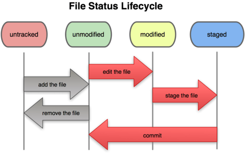

เมื่อสักปีที่แล้วได้ ไม่รู้ว่าจำกันได้หรือเปล่าว่า เราเขียนบทความเรื่องของ Version Control ตอนนั้นก็เล่าไปว่า เจ้า Version Control มันคืออะไร และมันดียังไง ทำอะไรได้บ้างอะไรทำนองนั้น ถ้าอยากลองกลับไปอ่าน [ตามลิงค์นี้เลย][0] จะได้รู้ที่ว่าของมันสักหน่อย แต่สำหรับคนที่เคยอ่านมาแล้ว หรืออยากจะข้าม ๆ มันไป วันนี้เรามาดู Version Control แบบที่เป็นที่นิยมอย่าง Git กันดูดีกว่า ว่ามันคืออะไร และใช้งานยังไง

## Git คืออะไร ?

Git เป็น Version Control ประเภทหนึ่ง (ย้ำนะว่าเป็น Sub Set ของ Version Control !!!) ที่เป็นระบบคอยเก็บความเปลี่ยนแปลงของไฟล์งานของเราเรื่อย ๆ ทำให้เราสามารถเรียกดูแต่ล่ะเวอร์ชั่นของไฟล์งานของเราได้อย่างง่ายดาย หรือดูได้แม้กระทั่งว่า แก้โดยใคร และเมื่อไหร่ได้อีกต่างหาก ลองนึกภาพเวลาเราทำงานเป็นทีมดูสิครับ มันจะวุ่นวายแค่ไหน ถ้าเราไม่ใช้ Version Control ความบรรลัยจะเกิดขึ้นแน่นอน เพราะต่างคนต่างแก้ไฟล์ที่อยู่ในเครื่องตนเอง และอีกคนก็ทำเช่นเดียวกันอีก ทำให้ไฟล์มั่วไปหมดเลย เพราะฉะนั้น การใช้ Version Control เป็นสิ่งที่ **จำเป็น** สำหรับการพัฒนาโปรแกรม ทั้งทำคนเดียว และเป็นทีมก็ตาม นะแจ๊ะ !

## Installation
ก่อนที่เราจะใช้ Git ได้เราต้องทำการติดตั้งมันลงมาก่อน ถ้าเป็นฝั่ง Linux จะง่ายมาก ๆ เพียงแค่รันคำสั่งเพียงบรรทัดเดียวตามด้านล่างนี้ก็เรียบร้อยแล้ว

    sudo apt-get install git-all

หรือถ้าเป็นในฝั่งของ OSX และ Windows ให้เข้าไป[ตามลิงค์นี้][2] เพื่อไปโหลด Installer มาและติดตั้งตามขั้นตอนกันได้เลย
หลังจากที่เราติดตั้งเสร็จเรียบร้อยแล้ว เราก็ต้องมา Config ตัว Username และ Password สำหรับการใช้ Git กันต่อ โดยการพิมพ์คำสั่งตามด้านล่างนี้ลงใน Terminal และเปลี่ยนเป็นชื่อและอีเมล์ของตัวเองได้เลย

    git config --global user.name "NAME"
    git config --global user.email "EMAIL"

## Getting Started
ในวันนี้เราจะมาลองสร้าง โปรเจ็คแรกของเราง่าย ๆ เป็น Hello World โดยผมจะมี Folder นึงเก็บ Source Files ทั้งหมด โดยขั้นตอนแรก ให้เรา Change Directory ไปที่ Folder ที่เก็บ Source Files ก่อน และทำการสร้าง git repository โดยการพิมพ์คำสั่ง

    git init

และเรายังสามารถเรียกคำสั่ง git status เพื่อทำการดูสถานะของโปรเจ็คเราได้ด้วย เช่น ตอนนี้ผมมี Source File อยู่ชื่อ main.c พอเรารัน git status ก็จะขึ้นดังนี้

    On branch master
    Initial commit
    Untracked files:
    (use "git add <file>..." to include in what will be committed)
    main.c
    nothing added to commit but untracked files present (use "git add" to track)

โดยสิ่งที่มันจะบอกเราคือ ไฟล์ไหนอยู่ในสถานะไหนบ้าง (เรื่องของสถานะ เดี๋ยวจะอธิบายตอนล่าง ๆ)
โดยปกติ ถึงแม้ว่าจะมีไฟล์อยู่ใน Folder ของโปรเจ็คเรา แต่ Git มันก็ไม่ได้ถือว่าไฟล์นี้จะใช้นะ เราจะต้องทำการไปเพิ่มมันเข้ามา เพื่อสั่งใน git มันทำการตามดูไฟล์นั้น ๆ ว่ามีความเปลี่ยนแปลงอะไรบ้าง โดยการใช้คำสั่ง git add เช่นผมจะเอาไฟล์ main.c เข้ามา โดยการรันคำสั่ง

    git add main.c

จากการรันคำสั่งด้านบน จะทำให้ main.c ถูกนำเข้ามาใน git project ของเราแล้ว เราสามารถลองดูผลได้จากการรัน git status อีกรอบ

    On branch master
    Initial commit
    Changes to be committed:
    (use "git rm --cached <file>..." to unstage)
    new file:   main.c

จะเห็นได้ว่า ในส่วนของ Untracked File ได้หายไปแล้ว เพราะเรา Add มันเข้ามาแล้วผ่าน git add ไปแล้วไง

## ว่าด้วยเรื่องของ File State ใน Git
จากหัวข้อเมื่อครู่ เราจะเห็นว่า ไฟล์แต่ล่ะไฟล์มันจะมีสถานะของมันอยู่ โดยเราสามารถแบ่งมันออกเป็น 4 สถานะได้แก่

* **Untracked** -\> ไฟล์ที่ยังไม่ได้ Add เข้ามาใน Project
* **Unmodified** -\> ไฟล์ที่ยังไม่มีการแก้ไข
* **Modified** -\> ไฟล์ที่มีการแก้ไขแล้ว
* **Staged** -\> ไฟล์ที่พร้อมจะ Commit
อ่านมาน่าจะ งง แน่ ๆ มันคืออะไร งง ไปหมดแน่นอน เพื่อทำให้คลายความ งง เราจะลองมาดูกันเป็นขั้นตอนกันเลยดีกว่า ก่อนอื่น เหมือนกับตอนแรกเลยที่เรามีไฟล์อยู่ใน Folder ของโปรเจ็คจริง ๆ นะแต่ตัว Git มันไม่ได้ยุ่งอะไรกับไฟล์นั้น ๆ เลย เราเรียกสถานะนี้ว่า **Untracked**
หลังจากที่เรา Add มันเข้ามาใน Git ของเราแล้ว ไฟล์นั้นก็จะอยู่ในสถานะที่เรียกว่า **Unmodified** หรือไฟล์นั้น ๆ ยังไม่ได้ผ่านการแก้ใด ๆ ทั้งสิ้นแม้แต่ Space bar เดียวก็ไม่มีเปลี่ยนเลย จากนั้นพอเรา แก้ไขไฟล์นั้น ไฟล์นั้นก็จะมีการเปลี่ยนแปลง เราเลยเรียก State ที่มีการเปลี่ยนแปลงนั้นว่า **Modified**
ทีนี้เกือบสุดท้ายล่ะ หลังจากที่เราแก้ไฟล์ไปแล้ว เราก็เซฟ ไฟล์นั้น ๆ ก็จะพร้อมแล้วที่จะถูก Upload ลงไปในใน Git ของเรา เราจะเรียก State ที่ไฟล์นั้นถูกแก้ไข และพร้อมที่จะ Upload ลงไปใน Git ว่า **Staged**

จากที่ได้เล่าไปเมื่อกี้ มันก็จะกลายมาเป็นภาพด้านบนนี้เลย นั้นคือเราใช้ git add มันเข้ามา แก้ไฟล์ และ commit มันกลับไป ถึงประโยคนี้อาจจะชะงักไปว่า "เฮ้ย !! Commit คืออะไรว่ะ ?" ต้องอธิบายว่า เราเรียกการบันทึกการเปลี่ยนแปลงของไฟล์เราลงใน Git เราจะเรียกมันว่าการ Commit หรือถ้าเราพูดตามภาพนี้มันก็คือ การที่ไฟล์นั้นเปลี่ยนจากสถานะ Staged มาเป็น Unmodified อีกครั้งนั่นเอง โดยเราสามารถ Commit ได้โดยการใช้คำสั่ง git commit เช่นผมได้ทำการแก้ไฟล์ main.c ไปแล้ว ตอนนี้ต้องการที่จะ commit มันลงไป ผมก็ต้องรันคำสั่งตามด้านล่างนี้

    git commit -m "Hello Name"

วิธีการใช้คือ git commit -m "MESSAGE" โดย MESSAGE คือข้อความที่เราต้องบอกว่า เราได้ทำการแก้ไขอะไรไป คร่าว ๆ อ่านแล้วรู้เลยอะไรทำนองนั้น หลังจากที่เรารันคำสั่ง commit ไปแล้วมันก็จะตอบกลับมาว่า มีการ Commit ไปกี่ไฟล์ และเปลี่ยนกี่จุด อะไรทำนองนั้น
\[master (root-commit) af7c65b\] Hello Name
1 file changed, 7 insertions(+)
create mode 100644 main.c
และเราสามารถดูได้ด้วยนะว่า ไฟล์ก่อนการ Commit และหลัง Commit มีอะไรเพิ่ม หรือถูกลบตรงไหนบ้าง บรรทัดไหน ตัวไหน โดยการรันคำสั่ง git diff ได้เลย เช่น

    git diff

และสิ่งที่ได้ออกมาคือ

    diff --git a/main.c b/main.c
    index 13846d8..9247a70 100644
    --- a/main.c
    +++ b/main.c
    @@ -2,6 +2,6 @@
    int main ()
    {
    -       printf("Hello World !!");
    +       printf("Hello Nung !!");
            return(0);
     }

จริง ๆ มันต้องมีสีแดง กับสีเขียวด้วยนะ แต่ก็ช่างมันเถอะ ดูที่หน้าบรรทัด ที่มีเครื่องหมายบวก และลบได้ โดยเครื่องหมายบวก แสดงถึงบรรทัดที่มีการเพิ่มขึ้นมา และในทางกลับกันเครื่องหมายลบแสดงบรรทัดที่ถูกลบออกไป

## มารู้จักกับ Branch และ Merge
ถ้าเรามอง File State เมื่อครู่เป็น Process จะเห็นได้ว่า เราแค่แก้ไฟล์ และ Commit มันไปเรื่อย ๆ ถ้าเราลองวาดรูปมันก็จะออกมาเป็นเส้นตรงที่เรา Commit ความเปลี่ยนแปลงของไฟล์ของเราลงไปเรื่อย ๆ แต่ Git ก็ใจดีมาก มันมีอีก Feature นึงขึ้นมาที่เรียกว่า **Branch **โดยสิ่งที่มันทำ ก็ตามความหมายของคำว่า Branch เลยนั่นคือ การแตกกิ่ง
จากเมื่อกี้ผมบอกว่า การที่เรา Commit การเปลี่ยนแปลงของไฟล์เราไปเรื่อย ๆ มันก็เหมือนกับเส้นตรง แต่ Branch นี่แหละ มันจะทำให้เส้น Timeline ของเรามีการแตกกิ่งออกไป โดยปกติเราจะใช้ branch กันเยอะมากในการทำงานเพราะ เวลาเราแก้อะไร มันก็จะอยู่แค่ในกิ่ง ๆ นั้น ไม่ไปยุ่งเกี่ยวกับ กิ่งหลัก เพื่อป้องกันการสร้างความบรรลัยแก่โปรเจ็คนั่นเอง
เราสามารถสร้าง branch ใหม่ได้โดยการใช้คำสั่ง

    git branch NAME

โดยให้เราแทนที่ NAME เป็นชื่อ Branch ที่เราต้องการได้เลย และมันยังมีอีกคำสั่งนึงที่ใช้ดูว่าในโปรเจ็คของเรามี Branch อะไรบ้าง โดยการใช้คำสั่ง

    git branch

โดยสิ่งที่เราจะได้ออกมาคือ

      Nung
    * master

รายชื่อของ Branch ในโปรเจ็คของเรา โดยดอกจันทร์ข้างหน้าแสดงถึง branch ที่เราทำงานอยู่ เราสามารถสลับ Branch ที่เราทำงานอยู่ไปมาได้โดยการใช้คำสั่ง checkout เช่นผมจะสลับไปที่ Branch ที่ชื่อว่า Nung

    git checkout Nung

และพอเราลองรัน git branch ดูอีกทีจะเห็นว่าดอกจันทร์มันไปอยู่ที่ Nung ซะแล้ว

    * Nung
      master

หลังจากที่เรา Branch มันออกมาแล้ว เมื่อเราทดสอบแล้วพบว่า ส่งที่เราทำเพิ่มมันโอเคแล้ว เราจะเอามันกลับไปที่ Branch หลัก เราจะเรียกขั้นตอนในการนำกลับไปว่า Merge โดยเราจะใช้คำสั่ง git merge NAME เช่นผมต้องการ Merge branch ที่ชื่อว่า Nung กลับไปก็เพียงรันคำสั่ง

    git merge Nung

และนี่คือทั้งหมดแล้วของ Git ที่เราจะได้ใช้ในชีวิตประจำวันบ่อย ๆ จริง ๆ แล้วมันยังมีเรื่องยิบย่อยอีกมากมาย แต่ก็จะไม่เขียนถึงในบทความนี้ เพราะถ้าเขียนมานี่ หมดไปเป็นสิบหน้าก็คงเขียนไม่หมดแน่นอน (แต่ถ้าอยากรู้ เดี๋ยวจะแปะลิงค์ไว้ตรง Reference ให้)

## จาก Local สู่ Online
จากที่ได้กล่าวไป จะเป็นการสร้าง Project ในเครื่องของเราคนเดียว หรือ Local นี่เอง แต่ถ้าเราอยากที่จะ Publish มันลงไป ในปัจจุบันมีผู้ให้บริการมากมายเปิดให้บริการ Git Server ให้เราได้ใช้กัน เราลองมาดูอันที่เราน่าจะใช้บ่อย ๆ หรือเป็นที่รู้จักกัน

1. **Github** - อันนี้น่าจะเป็นที่รู้จักของคนส่วนใหญ่มาก ๆ เพราะถือว่าเป็นแหล่งที่มีการแชร์ Source Code น่าจะเยอะที่สุดในโลกแล้วมั่ง เราสามารถสร้าง Project ของเราได้ไม่จำกัด และไม่เสียเงินสักบาทด้วย แต่ !! โปรเจ็คที่เปิดมา มันจะเป็น Public คือใครก็สามารถเข้ามาดู Souce Code ได้หมด ทั่วโลกเลย แต่ถ้าต้องการใช้แบบ Private ก็สามารถทำได้เช่นกัน โดยการเอาเงินของพวกนายไปมอบเส้นมัน
2. **Bitbucket** - ตัวนี้ก็เป็นอีกตัวที่ค่อนข้างดังอยู่เหมือนกัน แต่มันจะต่างจาก Github แบบกลับหัวเลย เพราะว่า Gitbucket จะให้บริการแบบ Private Project ได้ไม่จำกัดเลย แต่มันจะไปจำกัดจำนวนของ User ที่สามารถใช้ได้ นั่นคือ 5 คน แต่ถ้ามากกว่านั้น ก็ต้องเอาเงินมาเส้นมันเหมือนกับ Github
และนอกจากนี้ยังมี Hosted Git Server หรือ Git Server ที่อยู่ใน Host ของเราด้วยนะ เช่นพวก GitLab โดยเราสามารถไปโหลดมาแล้วติดตั้งลงไปใน Host เราและใช้งานได้เลย สะดวกมาก เหมาะสำหรับคนที่ไม่ชอบใช้บริการ Git ที่ใช้ Host ร่วมกันนั่นเอง

## สรุป
การใช้ Version Control ถือว่าเป็นสิ่งจำเป็น MUST เลยในการพัฒนาโปรแกรมในปัจจุบันจริง ๆ ไม่ใช้นี่ผมถือว่า บาป จริง ๆ นะ (จิ๊กคำของพี่เนยมาหน่อย) เพราะมันอาจจะทำให้การทำงานของเราเกิดความสับสน ทำงานกัน งง ๆ จนนำไปสู่ความล้มเหลวได้ และผมได้พูดถึงการใช้ติดตั้งและใช้งาน Git ใน Command Line ไปคร่าว ๆ แต่ในปัจจุบันนั้น มีโปรแกรมที่ทำออกมาเป็น GUI เพื่อให้ใช้งานได้ง่ายขึ้นมากมายไปหมด แต่ทั้งหมดนี่ยังเป็นแค่ผิว ๆ เอามาเฉพาะส่วนหลัก ๆ เท่านั้น ฉะนั้นแนะนำให้ไปอ่านเพิ่มจากที่อื่น ๆ ด้วยจะดีมากเลยนะครับ และสุดท้ายนี้ก็หวังลึก ๆ ว่า จะทำให้ใครที่เข้ามาอ่านเข้าใจวิธีการใช้งาน Git ได้อย่างถูกต้องกันนะครับ

## Reference
* [Official Git][4]
* [GIT IMMERSION][5]
* [Atlassian][6]

[0]: https://arnondora.in.th/whatisversioncontrol/
[2]: https://git-scm.com/downloads
[4]: https://git-scm.com
[5]: http://gitimmersion.com
[6]: https://www.atlassian.com/git/tutorials/
