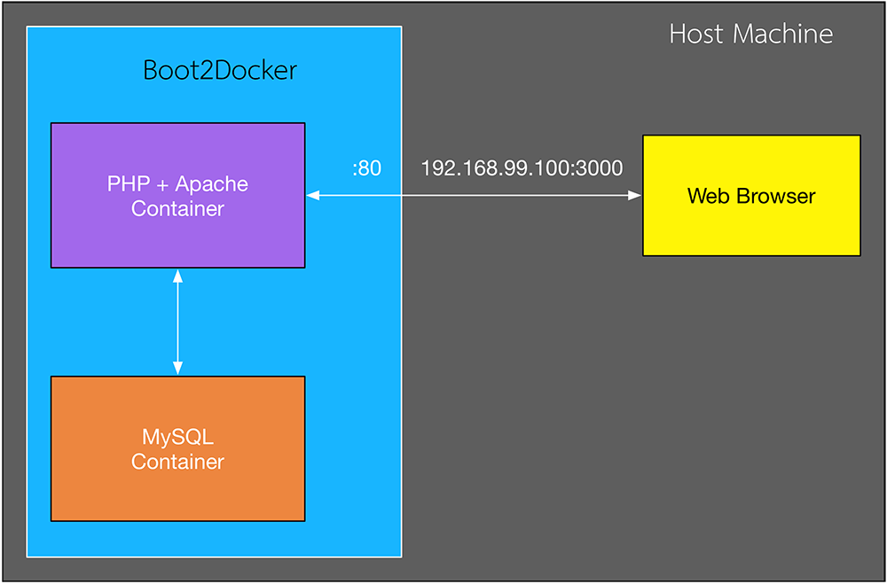

จากตอนที่แล้ว ที่เขียนเรื่องของ Docker ไปก็มีหลายคนสนใจมาก ๆ วันนี้เลยจะมาต่อยอดจากคราวที่แล้วกัน เราจะมาลองทำ LAMP Stack ไว้ใช้งานกัน

## LAMP Stack คืออะไร ?
อันนี้อธิบายเพื่อใครไม่รู้จัก LAMP Stack คือชุดของ Software 4 ตัวที่มารวมกันเพื่อทำ Web Server ที่เราใช้ ๆ กันอยู่นี่แหละ โดยมันประกอบด้วย

1. **L** แรกคือ Linux ที่เป็น OS ที่เราน่าจะรู้จักกันดี
2. **A** คือ Apache หรือ Web Server
3. **M** คือ MySQL ที่เป็น Database ให้เราใช้งาน
4. **P** คือ PHP เป็น ภาษาที่เราใช้เรียกและดึงข้อมูลต่าง ๆ

## มาลองสร้างกัน
ใน Workshop นี้จะไม่พูดพร่ำทำเพลงอะไรมา เอาเนื้อ ๆ (18 หลุมแน่นอน) เลยล่ะกัน จะได้ไม่ยาวมาก โดยขั้นตอนของเราสั้นมาก ๆ ลิงยังน่าจะทำได้เลย ง่ายจริง ๆ

1. สร้าง Container สำหรับ MySQL
2. สร้าง Container สำหรับ PHP และรัน Apache
3. Link ทั้ง 2 Container เข้าด้วยกัน
4. ติดตั้ง MySQL PDO Driver สำหรับ PHP
5. เปิดการใ้ช้งาน RewriteEngine (ถ้าต้องการใช้)

## 1 สร้าง Container สำหรับ MySQL

เราสามารถเข้าไปดูใน [Docker Hub][0] ได้ว่าเราสามารถทำอะไรกับ Image ของ MySQL ได้บ้าง ในที่นี้ขอสร้าง Container ของ MySQL เวอร์ชั่นล่าสุด ชื่อว่า test-db ล่ะกัน เราสามารถใช้คำสั่งตามด้านล่างนี้ได้เลย

    docker run --name test-db -e MYSQL_ROOT_PASSWORD=mypassword -d -p 3306:3306 mysql

จากคำสั่งด้านบน เราทำการสร้าง Container ที่เป็น MySQL เวอร์ชั่นล่าสุด ชื่อว่า test-db ขึ้นมา โดยให้มันโยนค่า MYSQL\_ROOT\_PASSWORD ที่เป็น Password ของ MySQL ว่า "mypassword" และให้มัน map port หรือสร้างวาร์ประหว่าง port 3306 ของเครื่อง VM กับ port 3306 ของเครื่องเรา

## 2 & 3 สร้าง Container สำหรับ PHP และ Apache และ Link ทั้ง 2 Container เข้าด้วยกัน

ชื่อขั้นตอนยาวชะมัด แต่ขั้นตอนนั้นง่ายแสนง่าย รันแค่คำสั่งเดียวก็เรียบร้อยแล้ว ให้เรารันคำสั่งด้านล่าง เพื่อสร้าง Container สำหรับ PHP และ Apache

    docker run --name test-site --link test-db:mysql -p 3000:80 -d -v /Users/arnonpuitrakul/Documents/test_site:/var/www/html/ php:7-apache

จากคำสั่งด้านบน เราทำการสร้าง Container ที่เป็น PHP พร้อมกับรัน Apache ในตัวพร้อมกับสร้าง วาร์ปเป็น Port 3000 ของเครื่องเรากับ Port 80 ในเครื่อง VM และให้มันสร้างวาร์ประหว่างใน Folder test\_site ซึ่งเป็นที่ที่ผมจะเก็บไฟล์ของเว็บทั้งหมดลงไป เข้ากับใน Folder html ที่เป็น Root Directory ของ Apache
และสุดท้าย ท้ายสุด เราให้มันสร้างวาร์ปอีกจุดที่ test-db ซึ่งเป็น Container ที่รัน MySQL ที่เราพึ่งสร้างไปเมื่อครู่ กับ test-site ที่เราพึ่งสร้างไป
จนถึงตอนนี้เราสามารถเรียกหน้าเว็บไซต์ของเราขึ้นมาได้แล้วที่ IP Address ของ VM และใช้ Port 3000 แต่ถึงเราเชื่อม Container กับ MySQL แล้ว แต่เราก็ยังไม่สามารถเชื่อมต่อผ่าน PHP ได้ ถ้าใครถึงขั้นตอนนี้และลองเขียนดูจะพบ Error ประมาณว่า "no driver found" อะไรประมาณนี้ จึงต้องทำขั้นตอนที่ 4 ต่อเพื่อให้เราสามารถเชื่อมต่อ MySQL ผ่าน PHP ได้

## 4 ติดตั้ง MySQL PDO Driver สำหรับ PHP
ในขั้นตอนนี้เราจะมาติดตั้ง PDO Driver สำหรับ MySQL บน PHP กัน โดยเราจะใช้คำสั่งตามด้านล่างเพื่อติดตั้ง

    docker exec -it test-site docker-php-ext-install pdo pdo_mysql

จากคำสั่งด้านบนเป็นการ สั่งให้ Docker เข้าไปรันคำสั่งให้ติดตั้งส่วนเสริมที่ชื่อว่า pdo\_mysql เพิ่มใน Container ชื่อ test-site และสุดท้าย เพื่อให้ Apache โหลดส่วนเสริมที่เราพึ่งติดตั้งเข้าไป เราจึงต้อง Restart Container ใหม่อีกครั้ง โดยใช้คำสั่งตามด้านล่างนี้ เท่านี้ก็เป็นอันติดตั้งเรียบร้อย

    docker restart test-site

## 5 เปิดการใช้งาน RewriteEngine (ถ้าต้องการใช้)
RewriteEngine เป็น Software ตัวนึงที่รันอยู่บน Apache เพื่อจัดการกับ URL Request ที่เข้ามาเช่น เราอยากให้เข้าไปที่หน้านึง แล้วบน URL ขึ้นตามที่เรากำหนดเอง เช่น example.com/note แทนที่จะเป็น example.com/note.php อะไรแบบนี้ หรือสำหรับใครที่ติดตั้ง Framework ต่าง ๆ เช่น Laravel ที่ต้องมีการใช้ Software ตัวนี้ก็ต้องทำการเปิดใช้งานด้วยเช่นกัน วิธีการเปิดใช้งาน ก่อนอื่นให้เรา SSH เข้าไปที่ Container ที่รัน Apache ก่อน (ในที่นี้ชื่อ test-site) โดยใช้คำสั่ง

    docker exec -it test-site bash

จากนั้นให้เราเปิดการใช้ RewriteEngine โดยใช้คำสั่ง

    a2enmod rewrite

และเรียกคำสั่ง exit เพื่อออกก็เป็นอันเสร็จเรียบร้อยแล้ว

## สรุป
ด้วย 5 ขั้นตอนนี้เราก็จะได้ LAMP Stack เพื่อใช้พัฒนาเว็บไซต์กันแล้ว โดยโครงสร้างที่ใช้จะเป็นตามรูปภาพนี้

นั่นคือ มีเครื่องเราที่อยู่ข้างนอกสุด และด้านในจะมีเครื่องที่เป็น Linux เพื่อไว้ใช้รัน Docker (เนื่องจากเครื่องที่ผมใช้เป็น OSX เลยต้องมี VM ที่เป็น Linux ครอบอีกรอบ) และใน VM เรารันอยู่ 2 Container นั่นคือ PHP+Apache และ MySQL โดยเราให้ทั้ง 2 Container นี้เชื่อมต่อกันเอง โดยที่ไม่ผ่านเครื่องเรา ที่ต้องทำแบบนี้เป็นเหตุผลเรื่องของความปลอดภัย จริง ๆ ซึ่งความสามารถนี้มันมาใน Docker เวอร์ชั่นใหม่ และเราทำการ Map Port ระหว่างเครื่องเรากับ VM ข้างในด้วยเช่นกัน นั่นคือข้างนอกเรียกเข้าไปเป็น 3000 แต่พอเข้ามาข้างใน ตัว Linux มันจะแปลงเป็น Port 80 เพื่อไปเรียก Web Server ให้เราโดยอัตโนมัติ
ถ้าเป็นเวอร์ชั่นเก่า เราจะเชื่อมต่อจาก MySQL Container ไปที่เครื่องของเราผ่าน Port และจากเครื่องเราไปที่ Apache อีกทอดนึง ซึ่งเมื่อมันต้องออกไปข้างนอก ความกังวลในเรื่องของความปลอดภัยจึงเกิดขึ้น วิธีแก้ไขก็คืออย่างที่เราได้อ่านกันมานั่นคือ การให้ 2 Container เชื่อมต่อคุยกันใน VM กันเอง ไม่ต้องออกมาข้างนอก
ทั้งหมดนี้ก็เป็นอีกตัวอย่างนึงที่หลาย ๆ คนน่าจะต้องลองเคยทำกันบ้างแล้ว ถ้าได้ลองหัดใช้ Docker ตอนนี้ผมก็เป็นคนนึงที่พึ่งจะหัดใช้ได้ไม่นาน (ปีนิด ๆ เอง) การสร้าง Container แบบนี้น่าจะเป็นตัวอย่างที่ดีของการหัดใช้ Docker กัน เพราะได้ทำการเชื่อมหลาย ๆ  Container และได้หัด Setup หลาย ๆ แบบ สำหรับบทความนี้ก็หวังว่า คนที่พึ่งหัดใช้ น่าจะได้รู้อะไรเยอะมากขึ้นนะครับ สวัสดีครับ

[0]: https://hub.docker.com
[1]: http://128.199.220.9/wp-content/uploads/2016/06/LAMP_with_docker_1.png
