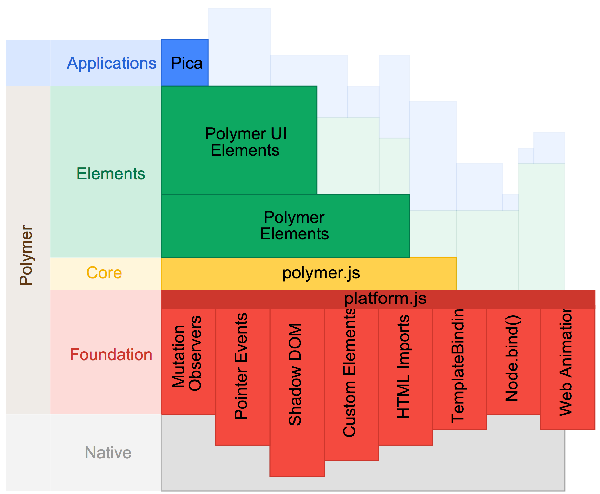

## Web Polymer ความคิดใหม่สุดแหวกแนวในการสร้าง Web Application
เจ้า **Web Polymer Google** ได้เปิดตัวจริงๆจังๆตั้งแต่ในงาน **Google I/O 2013** แล้วล่ะครับ แต่ตอนนั้นผมก็ยังเฉยๆกับมันอยู่ แต่ตอนนี้พอเข้าไปลองเล่นจริงๆแล้ว มันเจ๋งมาก
หลักการทำงานของมันก็คือการแยกส่วนต่างๆของ **Web Application** ออกเป็นส่วนๆ แยกกันทำงานอย่างอิสระ เวลาเราใช้ก็เพียงก็นำมันมาต่อรวมกันเท่านั้นเอง (เหมือนเล่น Lego เลยเนอะ)

## ถามว่า Web Polymer จริงๆแล้วมันคืออะไรกันแน่ล่ะ?
เอาจริงๆแล้วตามที่ **Google** เคยบอกไว้ มันคือ**UI Library** ตัวหนึ่งที่อิงหลักการของการสร้าง **Web Application** อย่างเต็มสตรีมกันเลยทีเดียว ซึ่งมันจะต่างกับพวก **Bootstrap** ที่เน้นการทำงานที่ค่อนข้างง่ายๆ
ซึ่งเจ้า **Polymer** จะมองวัตถุทุกชิ้นเป็น **HTML Tag** ชนิดนึงเลย ต่างจาก **UI Library** เจ้าอื่นๆที่อยู่ในแท๊ค **Div** แล้วค่อยใช้**Javascript/CSS** แปลงร่างมันทีหลัง

## โครงสร้างของ Web Polymer

มันจะ**ประกอบด้วย 3 ส่วนหลักๆ** คือ

* ส่วนแรกนั่นคือ **Foundation** หรือรากฐาน เป็นส่วนที่สำคัญของตัว **Polymer** มาก เพราะมันเป็นตัวที่ทำให้ **Web Browser** รู้จักกับตัว **Polymer** ยิ่งเวลาผ่านไปเจ้า **Foundation** จะหายไปเยอะขึ้น เพราะ **Web Browser** ได้ฝังมันมากับตัว **Web Browser** เรียบร้อยแล้ว
* ถัดขึ้นมานั่นคือ **Core** ของมัน มันเป็นส่วนที่ทำให้เราทำงานกับมันได้สะดวกมาก มันจะมีคำสั่ง **Build-in** อยู่ในนั่น เช่น **Data-binding **
* และสุดท้ายคือ **Elements** มันคือ **Elements** ที่ **Google** ทำมาให้สำเร็จรูปแล้วตาม **Meterial Design** หรือถ้าเราไม่พอใจก็สามารถสร้างเองได้

## แล้วเรื่องของ Performance ล่ะ?
โอ้!! ไม่ต้องคิดเลยครับ มันออกแบบมาให้ทำงานได้อย่างรวดเร็วมากครับ (เอาตามที่ **Google** ได้เคลมไว้ + โชว์ให้ดูในงาน Google I/O) มัน**รองรับการแสดงผลระดับ 60 fps** กันเลยทีเดียว แซ่บมาก!! ลองเข้าไปดูตัวอย่างของมันง่ายก่อนได้เลย

เป็น Paper Calculator ลองเข้าไปเล่นได้ที่ [https://www.polymer-project.org/0.5/components/paper-calculator/demo.html][0]

## มา Install มันกันเถอะ!!!
ก่อนอื่นจะต้องติดตั้ง Node.js ก่อนนะครับ เข้าไปได้ที่ [https://nodejs.org/][1]
หลังจากนั้นต้องไปติดตั้ง Bower  ซึ่งเป็นตัว Package Manager โดยการพิมพ์

    $ npm install -g bower

หลังจากนั้นเราก็จะได้ตัว bower มา ทีนี้ให้ cd ไปที่ Directory ที่เราต้องการหลังจากนั้นให้ทำการสร้าง Project โดยการพิมพ์

    $ bower init

เพื่อทำการสร้าง Project และหลังจากนั้น ให้ Install ตัว Polymer โดยใช้คำสั่ง

    bower install --save Polymer/polymer

เย้ๆๆได้แล้ว ทีนี้เราก็ติดตั้งเสร็จเรียบร้อยแล้ว!!! ตอนหน้าเราจะมาลองเล่นกับมันกัน

[0]: https://www.polymer-project.org/0.5/components/paper-calculator/demo.html
[1]: https://nodejs.org/
