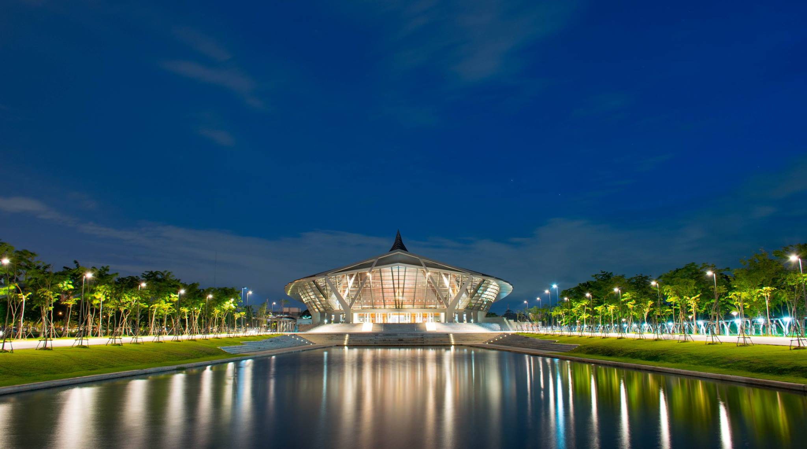

หลังจากที่เคยเล่า [เรื่องถ่ายรูปมาครึ่งปี][0] เมื่อโน้น นานยังหว่า จำไม่ได้ ก็มีเสียงเรียกร้องมาว่า พี่เริ่มยังไงค่ะ (จริงๆ เหมือนน้องเขาจะเป็นผช แต่ใส่ ค่ะ เพื่อความน่ารัก) วันนี้เราเลยจะมาสอน วิธีการปรับค่ากล้องง่ายๆ กันสำหรับมือใหม่ แบบใหม่จริงๆ เลย

## เกริ่น
จริงๆ การปรับตั้งค่ากล้องนั้นไม่มีอะไรเลย ถ้าเรารู้หลัก เรามาเข้าที่หลักง่ายๆ ของมันกันก่อนเลย รวมๆ แล้ว Settings ทั้งหมดของกล้องมันล้วนเกี่ยวกับแสงไปประมาณ 95% กันเลยทีเดียว เพราะว่าการถ่ายรูปก็คือการเก็บแสงสีนั่นเอง แล้วอีก 5% มันก็คือการตั้ง โฟกัส และการจัดองค์ประกอบภาพ ซึ่งเรื่องนี้ก็สำคัญไม่แพ้กัน แต่ในตอนนี้เราจะพูดถึงเรื่อง แสง และการโฟกัส กันก่อน

## แสง (Light)
แสง หรือในภาษาอังกฤษ Light เป็นส่วนที่สำคัญมากๆ ของการถ่ายภาพเลย แสงต่างกัน ก็ทำให้ความหมาย ความรู้สึกของรูปเปลี่ยนไปได้เลย โดยหลักๆ แล้วในกล้อง (ุถ้าเราใช้โหมด M ในกล้อง DSLR) เราจะสามารถตั้งค่า F-Stop, Shutter Speed และ ISO อย่างที่บอกไปว่า แสงมากแสงน้อยก็มีความสำคัญ ดังนั้นเราจะต้องปรับการตั้งค่าทั้ง 3 อย่างนี้ให้สัมพันธ์กัน ถ้าไม่รู้ให้เรานึกภาพว่า เรามีก๊อกน้ำ ที่มีแสงไหลออกมาลงบนภาพเรา
การตั้งค่า F-Stop จะเป็นการบอกว่า ก๊อกน้ำของเราใหญ่ขนาดไหน? ยิ่งก๊อกรูใหญ่ขึ้น ถ้าเราเปิดน้ำในเวลาเท่าๆ กัน ก๊อกที่รูใหญ่กว่าก็จะได้น้ำที่เยอะกว่า ก๊อกที่รูเล็กกว่า เช่นเดียวกันกับการถ่ายภาพ ยิ่งเราเปิดรู F-Stop ให้กว้างมากขึ้นเท่าไหร่ ภาพก็ยิ่งสว่างมากขึ้น นอกจากการปรับเพื่อแสงแล้ว การปรับ F-Stop จะมีผลต่อ DOF (Depth of Field) ด้วยพวกหน้าชัดหลังเบลออะไรแบบนี้ ยิ่งถ้าเราปรับ F-Stop เลขต่ำๆ จะทำให้เกิดการแยกส่วนกัน ที่แบบหน้าชัดหลังเบลอเลย ตรงข้ามกัน ถ้าเราปรับเลข F-Stop ให้มันสูงๆ สูงมากๆ ภาพมันจะทั้งหน้าชัด หลังก็ชัดเหมือนกัน เพราะฉะนั้นถ้าเราจต้องการที่จะถ่ายภาพแบบหน้าชัดหลังเบลอ เราก็ต้องเลือกค่า F-Stop ให้ต่ำๆ **และระวังดีๆ เพราะว่า เลขค่า F-Stop มันจะสวนทางกันนะ ถ้าเราเปิด F-Stop เลขเยอะๆ มันคือการที่เราปรับ รูรับแสงให้แคบลง กลับกัน ถ้าเราปรับ F-Stop เลขน้อยๆ มันคือการเปิดรูรับแสงให้กว้างขึ้น**

ลองมาดูตัวอย่างของภาพที่ปรับ F-Stop กันดู ภาพนี้เกิดจากการที่เราปรับ F-Stop ให้มันต่ำๆ นิดหน่อย ดูไม่ยากเลย เพราะว่า วัตถุที่เราจะถ่าย กับข้างหลังมันแยกกัน นิดหน่อย หรือเราเรียกว่า เบลอหลัง นั่นแหละ เหตุที่ต้องทำแบบนั้นเพราะว่า เราต้องการที่จะดึงจุดสนใจของภาพให้อยู่ที่ตัวดอกกันภัยนั่นเอง
เมื่อกี้เราพูดถึงขนาดของก๊อกไปแล้ว ถัดมาเราจะมาบอกว่า เราจะเปิดน้ำจากก๊อกนานแค่ไหน ถ้าเทียบกับการถ่ายรูปมันก็คือ Shutter-Speed นั่นเอง เพราะฉะนั้น ยิ่งเราเซ็ต Shutter-Speed นานๆ ก็ทำให้รูปมันสว่างขึ้นด้วย กลับกัน ถ้าเราใช้ Speed-Shutter ที่ต่ำ เราก็จะได้รูปที่ค่อนข้างมืดกว่า ถ้าเราตั้ง F-Stop เท่ากัน นอกจากนั้นอีกแล้ว การปรับ Shutter-Speed ก็ยังมีผลกับรูปด้วย ถ้าเราปรับ Shutter-Speed ต่ำๆ เลย เช่น 1/3200 อะไรแบบนี้ จะทำให้เราสามารถเก็บภาพที่เคลื่อนไหวได้เร็วๆ กลับกัน ถ้าเราถ่ายภาพอะไรที่มันไม่ได้เคลื่อนไหว เช่นตึก (ยกเว้นตึกที่เดินได้ ซึ่งไม่น่ามี) เราก็สามารถดัน Speed-Shutter ให้นานไปเลยก็ได้ การถ่ายภาพแบบนี้ เราจะเรียกว่า Long Exposure นั่นเอง **เช่นเดียวกันอีกแล้วกับ F-Stop ค่า Shutter Speed ที่เราปรับ ให้ดูหน่วยมันดีๆ เพราะว่ากล้องบางตัวมันจะเขียน 3200,1600 อะไรแบบนี้ ให้พึงระลึกไว้ว่า มันคือ 1/3200 และ 1/1600 นะ เพราะฉะนั้น 1/3200 จะเร็วกว่า 1/1600**

ตัวอย่างของ การใช้ Speed-Shutter ก็คือภาพนี้เลย ภาพนี้ดัน Speed-Shutter ขึ้นไปถึง 30 วินาทีกันเลยทีเดียว ณ ตอนที่ถ่ายจริงๆ ยุงกัดเจ็บและ มืดมากๆ แต่เพราะว่า เราตั้งค่าให้มันรับแสงนานขึ้น เราเลยได้ภาพที่สว่างกว่าตอนที่เราเห็นจริงๆ และลองสังเกตที่น้ำดู เห็นอะไรมั้ย มันดูมนๆ แปลกๆ แปลกกว่านำ้ปกติ นี่ก็คืออีกอย่างที่น่าเล่นกับ Long Exposure ถ้าเราลองถ่าย Long Exposure กับสิ่งที่เคลื่อนไหวดูมันก็จะสวยไปอีกแบบ เหมือนกับที่เขาปรับ Shutter-Speed นานๆ กับภาพน้ำตก ที่ทำให้น้ำตกมันเหมือนหมอกเลย
และสุดท้ายคือ ISO ค่านี้อาจจะใช้ ก๊อกน้ำนรก อธิบายไม่ได้แล้ว เอาง่ายๆ มันคือการปรับค่าความ Sensitive (นึกภาษาไทยไม่ออก!!) ของ Sensor กล้องเรา ถ้าใครเคยถ่ายรูปมาก่อนหน่อยๆ คนจะชอบพูดว่า "อย่าปรับ ISO เยอะนะ เดี๋ยว Noise จะเยอะ" ซึ่งมันจริง เพราะว่า ยิ่งเราปรับความ Sensitive ของ Sensor เราให้มากขึ้น มันก็เหมือนกับการ ขยายภาพเลย ยิ่งขยายให้มันใหญ่ขึ้นกว่าที่มันจะเป็น มันก็จะแตก เช่นเดียวกับ ISO ยิ่งเราเพิ่มความ Sensitive ของ Sensor มากขึ้น มันก็จะรับแสงแปลกๆ ที่ไม่เกี่ยวกับภาพเราเข้ามา ทำให้ภาพเราเกิด Noise นั่นเอง เพราะฉะนั้นการปรับ ISO ก็ควรจะปรับให้พอดี หรือเพื่อชดเชยกับแสงที่ไม่พอจากการปรับ F-Stop และ Shutter-Speed นั่นเอง

ภาพนี้ดูเหมือนจะไม่มีอะไร และดูน่าอร่อยมาก หิวเบย~~ แต่ที่เอาภาพนี้มาเป็นตัวอย่างของการปรับ ISO เพราะว่า ภาพนี้เล่น ISO ดันไปถึง 3200 กันเลยทีเดียว เหตุที่ตอนนั้น เราถ่ายในที่ที่ค่อนข้างมืด ประกอบกับ ไม่มีขาตั้งกล้องอีก เพราะฉะนั้นการปรับ Shutter-Speed นานๆ ให้สว่างจึงเป็นไปไม่ได้ แล้วถ้ามาปรับ F-Stop อีกก็ไม่ได้แล้วเหมือนกัน เพราะว่า DOF มันจะเปลี่ยนไป ดังนั้นจึงเหลือทางเดียวนั่นคือการดัน ISO ขึ้นไปหน่อย แต่ที่เห็นเหมือนมันไม่มี Noise นั่นก็เพราะว่า เราได้เอาไปเข้าโปรแกรมที่ช่วยเอา Noise ออกไปแล้ว ได้ออกไปนิดนึง ถ้ามาดูภาพต้นฉบับก็จะเห็นเลยว่า Noise เยอะจริงๆ

## Auto Focus VS Manual Focus
เรื่องนี้ก็เป็นเรื่องที่สำคัญมากเช่นกัน เพราะถ้าโฟกัสผิดภาพออกมานี่ ผิดกับที่เราอยากได้เลยนะ แต่ก่อนอื่น เราต้องมาเข้าใจกันก่อนว่า คนตาเราโฟกัสวัตถุยังไง อย่างเช่น ตอนนี้เราคงกำลังโฟกัสกับบทความที่กำลังอ่านอยู่นี่แน่ๆ ถ้าผมถามว่า ตอนนี้กี่โมง เราจะสามารถตอบได้มั้ย ถ้าตอนนี้เรากำลังจ้องอยู่ที่บทความนี้อยู่ กล้องมันก็เช่นกัน ถ้าเราตั้งจุด Focus ผิด เราก็จะไม่ได้รูปในแบบที่เราต้องการแน่นอน ในกล้องการ Focus เราสามารถทำได้ 2 แบบใหญ่ๆ เลยคือ การใช้ Auto Focus และการใช้ Manual Focus
การใช้ Manual Focus นั้นเป็นอะไรที่ Manual จริงๆ เพราะเราต้องมาหมุนวงแหวน Focus เพื่อหาระยะ Focus ที่ใช่กับภาพของเราด้วย มันอาจจะใช้เวลานานกว่า การใช้ Auto Focus แต่มันก็เป็นการ Guarantee ว่าเราสามารถที่จะได้จุด Focus ตามที่เราต้องการ
มาถึงตัวเด็ดแล้วนั่นคือ Auto-Focus ในกล้องรุ่นใหม่ๆ ในปัจจุบันระบบ Auto-Focus มันฉลาดมากขึ้นเรื่อยๆ มีหลายๆ โหมดมาให้เราเลือก แต่หลักๆ มันน่าจะเป็น Single Auto Focus (ชื่ออาจจะไม่เหมือนไปตามยี่ห้อของกล้องนะ) อันนี้จะเป็นการ Focus ที่จุดเดียว และเราสามารถเลือกได้ว่า เราจะให้มัน Focus ไปที่จุดไหนได้เลย แค่เลื่อนๆ ไป แล้วกด กล้องมันจะเลือกระยะ Focus ให้เราโดยอัตโนมัติ
อีกโหมดนึงคือ Multi point Auto Focus ถ้าเป็น Nikon ที่ผมใช้อยู่มันจะเป็น xx Point-AF อะไรนี่แหละแล้วแต่จำนวนจุด Focus ที่มีในแต่ล่ะรุ่น อันนี้มันจะอัตโนมัติกว่า Single Point AF เมื่อกี้เลย เพราะว่าเราไม่ต้องไปนั่งเลือกจุด Focus ว่าจะให้มันไป Focus ตรงไหน ทุกอย่างกล้องจะเลือกให้เองหมดเลย เราไม่ต้องไปยุ่งอะไรกับมัน
ตอนนี้หลายๆ คนที่อ่านจนจบ ก็น่าจะได้ เบื้องต้นของการถ่ายภาพกันแล้ว ตอนหน้าเราจะมาดูกันว่า การวัดแสงคืออะไร? White Balance คืออะไร? และ การจัดองค์ประกอบของภาพกัน ติดตามอ่านกันได้เลยครับผม

[0]: http://www.arnondora.in.th/photograph-half-year/
