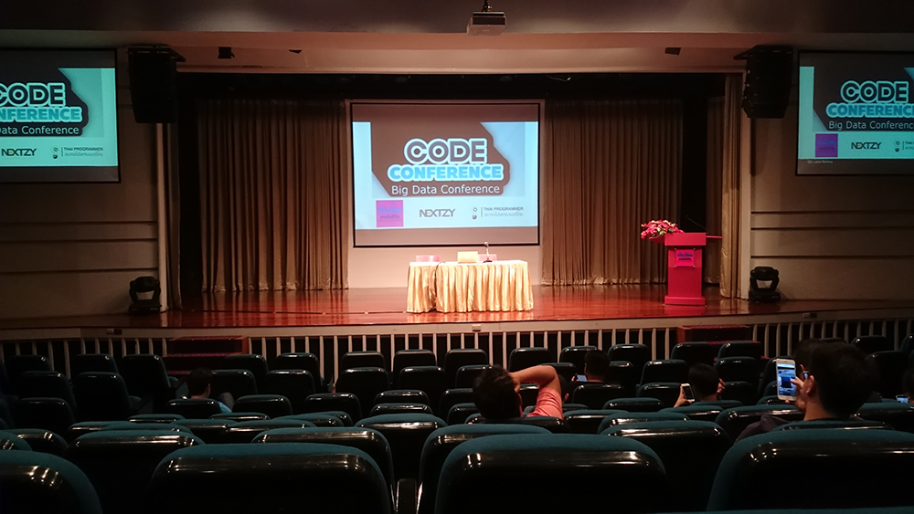

ก่อนอื่นต้องขอเกริ่นก่อนว่า วันนี้เราไปงาน Big data Conference ที่จัดโดยสมาคมโปรแกรมเมอร์ไทยมา ซึ่งในงานรวม ๆ ก็สนุกได้ความรู้หลาย ๆ อย่างดี (ชอบ Keynote ของอาจารย์ Rawitat มาก เนื้อหาในนี้ส่วนใหญ่จะดึงมากจากที่ อาจารย์ Rawitat พูดวันนี้เป็นส่วนใหญ่) เลยอยากจะเอามาเขียนเพื่อแบ่งปันกับคนที่ไม่ได้ไป แต่คงเขียนหมดของวันนี้ก็ไม่ไหวเหมือนกัน ขอเขียนเรื่องพื้นฐานจับหลาย ๆ เรื่องของวันนี้มา Remix กันจะดีกว่า ที่เหลือเป็นโค๊ต น่าจะยากสำหรับคนพึ่งหัด

ในวันนี้เราจะมาดูกันว่าจริง ๆ แล้ว Big Data คืออะไร ? คุณสมบัติของมันคืออะไร ? แค่ไหนเรียกใหญ่ ? และมันหน้าตาเป็นยังไง

## Big Data คืออะไร ?
หลาย ๆ คนที่อยู่ในวงการ หรือเรียนคอมพิวเตอร์มาบ้าง ตอนนี้ถ้าพูดคำว่า Big Data ก็ต้องเคยได้ยินกันมาบ้างแหละ ถ้าไม่เคยก็คงแปลกแล้วล่ะ เพราะเป็นสิ่งที่ทุกคนพูดถึงกันแทบจะตลอดเวลา (ในช่วงนี้อะนะ) เพราะทุกวันนี้เราคงปฏิเสธไม่ได้แล้วว่า ชีวิตประจำวันของเราในแต่ล่ะวินาทีที่หมุนไป เราสร้างข้อมูลใหม่ ๆ ขึ้นมาตลอดเวลาจริง ๆ ทั้งจาก Social Network เราโทรหาเพื่อน หรือค้นหาข้อมูลต่าง ๆ ล้วนเป็นการสร้างข้อมูลใหม่ ๆ ขึ้นมาบนโลกไซเบอร์มากขึ้นเรื่อย ๆ นอกจากพฤติกรรมของคนที่เปลี่ยนไปแล้ว เทคโนโลยีก็เปลี่ยนไปเช่นกัน จากคนหนึ่งคนมีอุปกรณ์เครื่องเดียว ตอนนี้คนนึงกดไปแล้ว 3-6 เครื่องเลยก็มี เพราะฉะนั้น ข้อมูลมาใหม่มากมายทุกวินาที ถามว่า เราจะทำอะไรกับมันได้บ้าง นี่แหละคือสิ่งที่ Big Data จะเข้ามาช่วยเรา เพื่อให้เราเข้าถึง และเข้าใจ ข้อมูลเหล่านั้นได้ รวดเร็ว และลึกซึ้งมากขึ้นนั่นเอง

## ลักษณะของ Big Data
อันนี้ผมก็ไปรู้มาจากการเปิดเน็ตหาไปเรื่อย ๆ นี่ล่ะครับ เขาบอกว่า ลักษณะของ Big Data มันจะประกอบด้วย 3V ด้วยกัน (บ้างก็ 5V, 2V บ้าง แล้วแต่ที่กันไป)

* **Volume** คือขนาดของ ข้อมูล ที่เราเอามาใช้
* **Velocity** คือความเร็วของการเพิ่มขึ้นของข้อมูล หรือเปลี่ยนแปลงอย่างรวดเร็ว
* **Variety** คือความหลากหลายของข้อมูล หรือหลากหลายแหล่งก็ได้เช่นกัน

## How much data do we need ?
ตอนที่อ่านนี้ ถ้าใครกำลังนึกถึงสัก 1 TB หรือ 1000 TB คุณคิดผิดนะครับ ลองเปลี่ยนมุมมองกันใหม่ ถ้าเราลองเทียบขนาดของข้อมูลสักก้อนเป็น บ้าน 2 หลังติดกัน ที่เวลาเรามักจะต้องเดินไปเคาะ คิดใช้เวลาเดินไปนานมั้ยครับ ?
ลองเทียบใหม่ ถ้าในหมู่บ้านนี้มีบ้านสัก 1000 หลัง คิดว่าจะเป็นยังไง ถ้าเราอยู่บ้านที่ 1 และต้องไปหาบ้านหลังที่ 1000 โดยการเดิน มันก็ถือว่า นาน ใช่มั้ยครับ
ลองคิดอีกรอบ ถ้าเราอยู่ในสถานการณ์เดิม แต่ผมบอกว่า "เฮ้ย เรามีรถให้ขับไปนะเว้ย" จากเราต้องเดินผ่านบ้านทีล่ะหลัง ก็กลายเป็นขับรถไปแทน เวลาที่เราต้องใช้ก็จะน้อยลงเยอะ และทำให้เรารู้สึกว่า 1000 หลังใกล้กันนิดเดียวเองใช่มั้ยครับ
สิ่งที่ต้องการจะสื่อคือ **เราไม่สามารถ วัดความใหญ่ ได้โดยใช้เพียงแค่ขนาดเท่านั้น แต่เราต้องเอาเวลามาเทียบด้วย** เหมือนกับที่อธิบายไปเมื่อครู่ ที่บ้าน 1000 หลังเหมือนกัน แต่ การเดินไป กับขับรถไป ทำให้ระยะทางที่รู้สึก มันช่างต่างกันราวฟ้ากับดินเลย ถ้าเทียบกลับไปเป็นเชิงของ ข้อมูล แล้วล่ะก็ ขนาดของข้อมูลก็คือนั้นเลย แต่เวลา น่าจะเป็นการถามว่า เราจะเข้าถึงข้อมูลนั้นได้เร็วมากแค่ไหน เหมือนกับการถามว่า เราจะเดิน หรือ ขับรถไปบ้านหลังที่ 1000 โดยใช้เวลาเท่าไหร่ นั่นเอง

## ความงอกก็บังเกิด
ในปัจจุบัน ถ้าเราไม่ได้ทำ Big Data อะไร เราก็จะใช้พวก RDBMS เก็บข้อมูลกัน ซึ่งก่อนที่จะสร้างเอามาลง DBMS เราก็ต้องรู้ Requirement อะไรมากมาย แล้วก็เอามาแปลงเป็น ER Diagram แล้วก็ Normalised ออกมาเป็นแบบของ DB จริง ๆ แล้วจึงเอาไป Implement บน DBMS ก็เป็นอันจบ แต่เมื่อข้อมูลเราเพิ่มขึ้นเรื่อย ๆ เราก็สามารถอธิบายมันได้ละเอียดมากขึ้น จากเมื่อก่อน เราอาจจะใช้สัก 3 คุณสมบัติในการอธิบายมัน แต่พอเวลาผ่านไป ตอนนี้เราอาจจะต้องใช้สัก 10 คุณสมบัติในการอธิบายมัน คิดว่า ถ้าเราใช้ RDBMS เก็บข้อมูลแบบธรรมดา คิดว่าจะเป็นอย่างไร คำตอบคือ การเพิ่มสัก Field นึง หรือการแก้ไข DB ที่ผ่านการใช้งาน และมีข้อมูลอยู่เป็นจำนวนมากอยู่แล้ว ถือว่าเป็นงานที่ไม่น่าทำเท่าไหร่ เพราะยากมาก ๆ และใช้ เวลากับเงินเยอะมาก ๆ วิธีการแก้ปัญหาของบางคนคือ การบอกว่า เราจะออกแบบเพื่ออนาคตไปสัก 10 ปี แต่เอาจริง ๆ คิดเหรอครับว่า เราจะคิดเพื่อได้ตรงขนาดนั้น ไม่ใช่หมอดูนะ ! เนื่องด้วยเหตุผลนี้เอง เลยทำให้บางบริษัท ก็แทบจะยอมที่จะอยู่กับที่ เลยทีเดียว รวม ๆ แล้วสิ่งที่ RDBMS ทั้งหลายเป็นคือ Structure ของมันถูก Fix ไว้ และก็เอาข้อมูลมาลงตามนั้นเรื่อย ๆ

## มองมุมกลับ สลับมุมมอง
ถ้าจะมาลองทำ Big Data อาจจะต้อง มองมุมกลับ สลับมุมมองกันหน่อย จากที่เมื่อก่อนเราเรียนมาในวิชา DBMS ว่า เราต้องออกแบบ ER จาก Requirement อะไรมากมายบลา ๆ แล้วก็เอาข้อมูลมาเติม แต่ใน Big Data พวกนี้เขาจะ เอาข้อมูลมาลง แบบ ไม่ สนใจ อะไรเลย ไม่สนว่า เก็บยังไง เก็บอะไร แล้วพอเราจะเอาออกมาเราคอยกำหนด Structure มาให้มันดึงมาให้เราเท่านั้นเอง ถามว่าข้อดีของแบบนี้คืออะไร ลองนึกสภาพว่า ถ้ามีบริษัท ที่ทำของเดียวกันอยู่สัก 5 บริษัท คิดจะแลกเปลี่ยนข้อมูลกัน ถ้าแต่ล่ะ บริษัทอยากจะแลกเปลี่ยนข้อมูลกัน พวกเขาก็ต้องตกลงเปลี่ยน DB เพื่อให้เป็นมาตราฐานอะไรยุ่งยากมากมายอีก ถ้าเราเลือกเก็บเป็นแบบที่ได้กล่าวไป เราก็แค่สร้าง API มาให้เรียก (ตอนนี้ Storage พวกนี้ก็ On Top อยู่บน API อยู่แล้ว) แล้วใครอยากจะเรียกอะไร ก็เรียกไป ไม่สนใจ ก็จบแล้ว เพราะเราเก็บทุกอย่างอยู่แล้ว ฉะนั้น เขาอยากจะดึงอะไร ก็ดึงได้หมด ในอนาคต เราจะเพิ่มอะไร ก็ไม่ต้องแคร์ เพราะสุดท้าย บริษัทที่เหลือก็จะดึงข้อมูลที่หน้าตาเหมือนเดิมไป เพราะ API จัดการแปลงให้อยู่ใน Format ที่ผู้เรียกต้องการแล้ว

## สรุปแล้ว Big Data เหมาะกับใคร ?
จริง ๆ แล้วเทคโนโลยีพวก Big Data เป็นอะไรที่เหมาะกับบริษัท หรือที่ที่เก็บข้อมูลเป็นจำนวนมาก ๆ มากแบบ มากจริง ๆ และมีความซับซ้อนมาก ๆ และมีความเร็วในการเปลี่ยนแปลงที่เร็วมาก ๆ ทำให้เราสามารถ วิเคราะห์ข้อมูลที่มีขนาดใหญ่ และซับซ้อนได้ในเวลาอันสั้น หรือแม้กระทั่ง Real Time ก็ได้เช่นกัน

## Big Data is a trend!
เดิน ๆ ไปก็มีแต่คนบอกว่า "Big Data is a trend" ถ้าเราไม่ทำตามนี่เราต้องตกเทรนแน่ ๆ เลย ถ้าคิดแบบนี้ หยุดตรงนั้นเลยนะ ! ใช่ครับว่า Big Data เป็นอะไรที่มาแรง แรงทะลุโลก แรงจนต้องร้องขอชีวิต แต่ให้ลองหันกลับมาดู Data ที่เราถือก่อนครับ ว่า เราใช้ข้อมูลที่เรามีทั้งหมดรึยังก่อนที่จะไป ถ้ายัง ผมว่า มันยังไม่ถึงเวลาที่จะเดินไปหา Big Data เท่าไหร่ อย่าลืมนะครับ ว่าข้อมูลเล็ก ๆ ที่เรามี ถ้าเอามาทำดี ๆ มันอาจจะเป็นการค้นพบอะไรใหม่เลยก็ได้นะ

## สรุป
เราก็ได้รู้กันไปแล้ว่า จริง ๆ แล้ว Big Data คืออะไร ? ผมมองว่าเรื่องของ Big Data ถือว่าเป็นอะไรที่มาแรงมากในปัจจุบัน เพราะว่า เทคโนโลยีก้าวหน้าขึ้นไปทุกวัน ผู้คนในปัจจุบัน ก็ต่างเข้าถึงอินเตอร์เน็ตกันมากขึ้น ทำให้จำนวนข้อมูลที่วิ่งอยู่บนโลกอินเตอร์เน็ตเพิ่มขึ้นเป็นเงาตามตัวเช่นกัน Big Data จะเข้ามาช่วยเรา ทำให้เราสามารถจัดการเก็บ และวิเคราะห์ข้อมูลขนาดมหึมาได้อย่างมีประสิทธิภาพมากขึ้น ทำให้ เจ้าของธุรกิจเข้าใจลูกค้าของตนได้มากขึ้น หรือค้นพบอะไรใหม่ ๆ ที่เกิดจากข้อมูลที่เราสะสมมาอยู่แล้วก็เป็นได้ ซึ่งตอนนี้เทคโนโลยีของ Big Data ตอนนี้ก็ถือว่า เริ่มที่จะจับต้อง และเข้าถึงได้แล้ว (เช่น Hadoop) ถึงแม้จะไม่ง่ายเท่าไหร่ (เพราะการ Setup เยอะระดับ หน้าสั่น หืดขึ้นคอ ใช้เวลาเป็นเดือน) แต่ก็เป็นจุดเริ่มต้นที่ดีสำหรับการเข้าสู่ยุคที่ข้อมูลเป็นกุญแจในการตัดสินใจ (Data Driven) แล้วครับ
